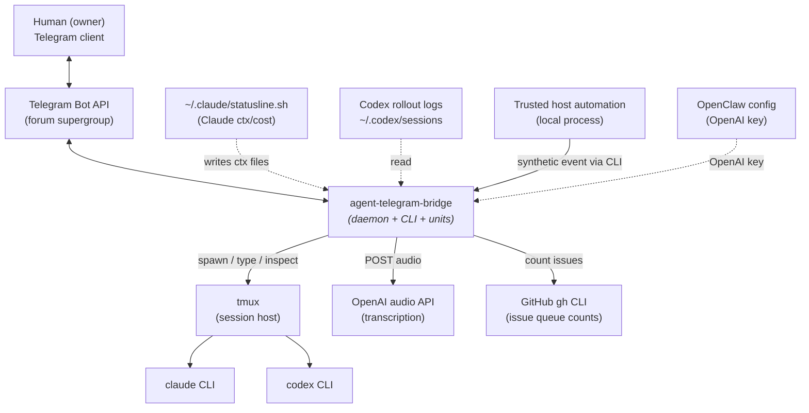
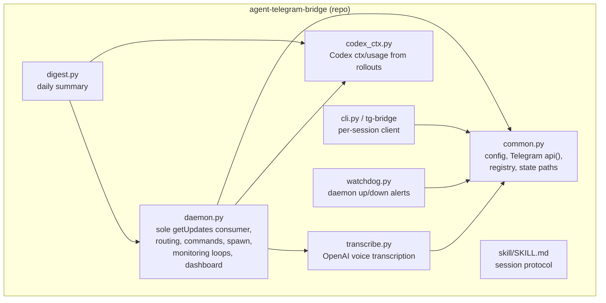
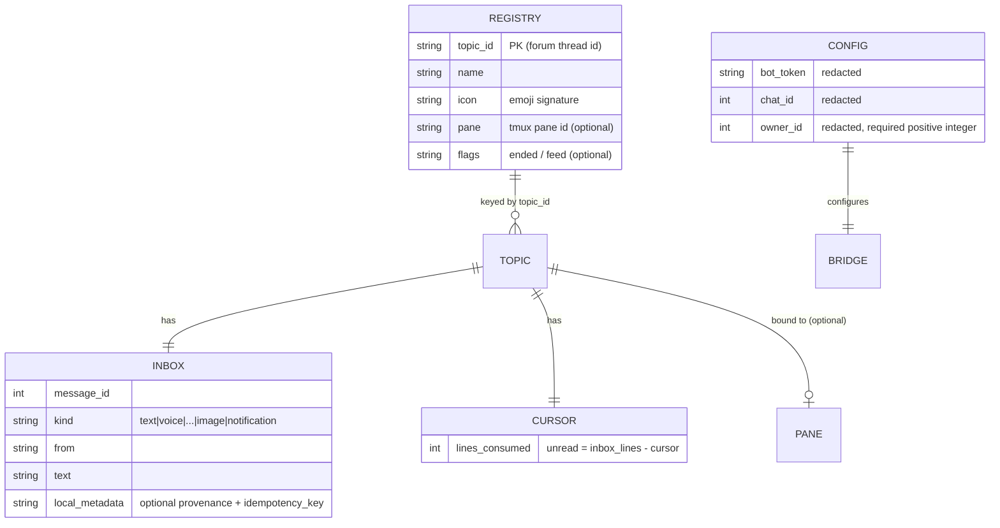
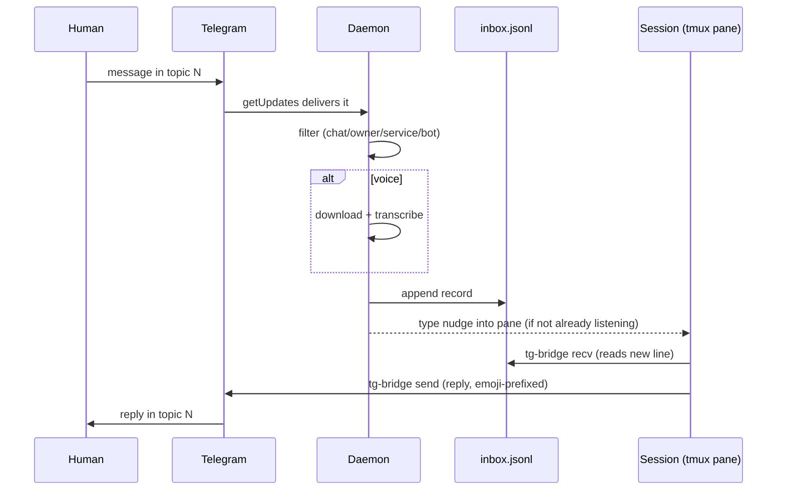
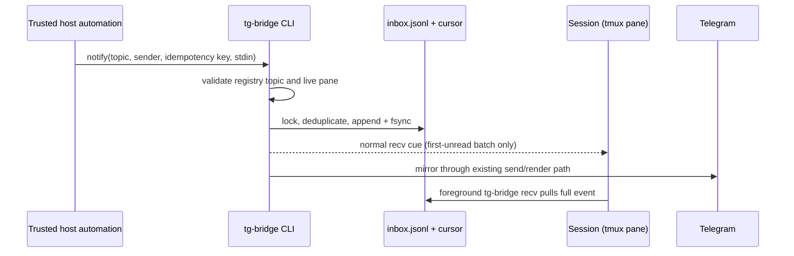
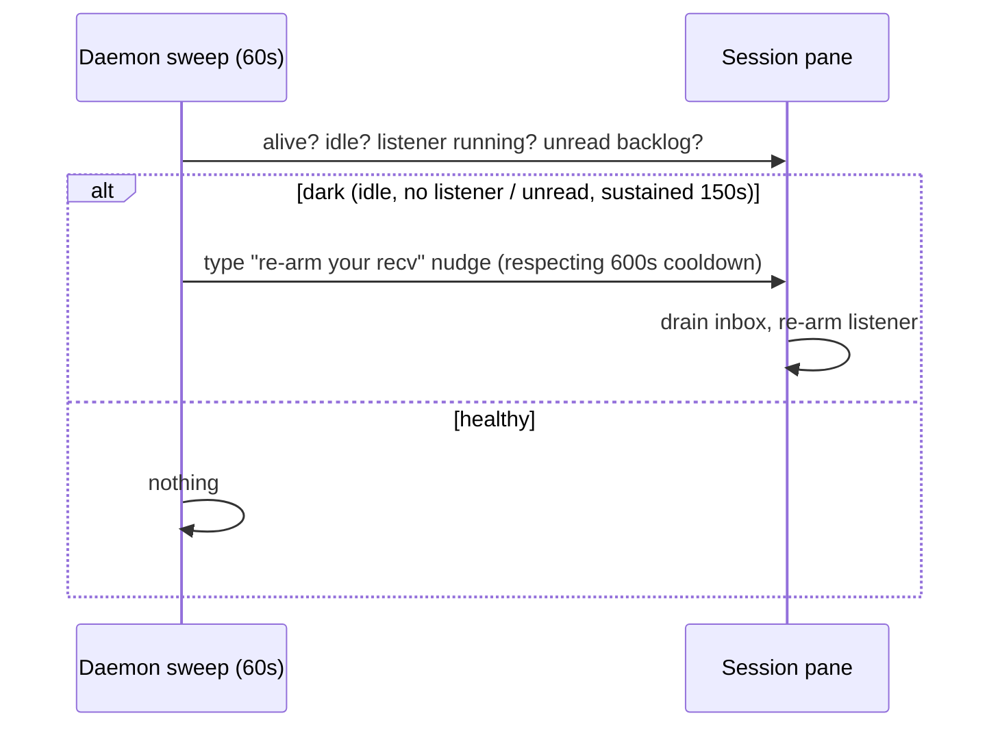
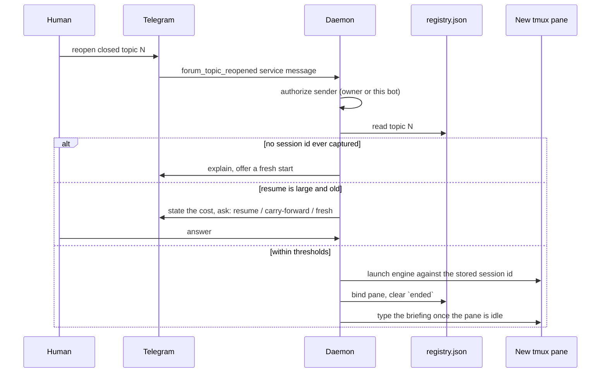

# agent-telegram-bridge — Architecture

## 1. Status

- **Document type:** system architecture (the shape of the system: boundaries, decisions, structure).
- **Provenance:** reverse-documented from the source code, which is the authority. There is no upstream PRD or architecture assessment; where the canonical shape expects PRD links, this document substitutes the code.
- **Companion:** [`SPECIFICATION.md`](./SPECIFICATION.md) carries the contract-level detail (schemas, CLI contracts, behavioral rules, acceptance criteria).
- **Verification:** content cross-checked against the code by an independent Claude pass and an independent Codex pass.
- **Redaction:** describes the shape and location of secrets, never their values.

## 2. Context & Constraints

The system lets headless AI coding sessions (`claude` and `codex` CLIs running in tmux) hold a two-way conversation with one human over a Telegram forum supergroup — one *session* topic per live session (General/thread 0 and feed topics are non-session topics), voice transcribed, images downloaded.

Fixed constraints (givens, not decisions):

- **One Telegram forum supergroup**, created once out-of-band; the bridge operates inside it and does not create it. The group's `chat_id` is supplied in config.
- **One bot account** for all sessions — Telegram shows every session as the same user.
- **One human** (owner) drives the system.
- **Two session engines**: Anthropic `claude` and OpenAI `codex`, each a third-party CLI the bridge launches but does not implement.
- **Host platform**: a single Linux host, tmux for session hosting, systemd **user** units for process supervision (no cron).
- **Telegram Bot API** semantics: `getUpdates` long-poll allows one consumer per bot token; `sendMessage` and topic creation are non-idempotent.

Two design priorities shape every structural decision:

1. **Never duplicate an outbound message** — a lost acknowledgement must not trigger a resend.
2. **Never let a session go silently unreachable** — a session that stops listening must be detected and revived.

## 3. Decision Summary

1. **Single Telegram update consumer.** Exactly one daemon process owns the Telegram `getUpdates` long-poll; every Telegram-originated event flows through it. (Telegram allows only one poller per token; a second yields HTTP 409.)
2. **Files as the message queue.** Inbound messages are appended to per-topic `inbox.jsonl` files; a per-topic `cursor` marks read position. Sessions never poll Telegram — they read local files via the CLI. Trusted host automation may append a synthetic event through the CLI boundary described in decision 11; it uses these same files rather than another queue.
3. **Asymmetric transport.** Inbound goes through the single daemon; outbound has no single consumer. **Session replies go directly from the per-session CLI to Telegram**; daemon- and aux-originated messages (control-command replies, the pinned dashboard, watchdog alerts, the daily digest) are sent by the daemon and aux modules directly via `api()`, not through the CLI. Only inbound needs the single-consumer guarantee.
4. **Classify failures, never blind-retry writes.** The Telegram API wrapper distinguishes "provably never sent" (safe to retry) from "delivery unknown after connect" (must not retry) — the structural defense against duplicate messages.
5. **Emoji signature per topic.** Because one bot account serves all sessions, each topic is assigned a distinct emoji that the CLI prepends to every message, giving the human a visual sender.
6. **Liveness by symptom, not cause.** A background sweep detects "dark" sessions (alive, idle, not listening) and re-pokes them, rather than enumerating the many ways a session can stop listening.
7. **Engine abstraction.** `claude` and `codex` are launched through one spawn path; their differences (model pin, trust pre-write, self-arming vs nudge-driven idle, context source) are isolated behind small per-engine branches.
8. **Context from external sources.** Claude context/cost is read from an external statusline hook; Codex context/usage is derived from Codex's own rollout logs. The bridge owns neither source.
9. **Out-of-band supervision.** A watchdog alerts the human when the daemon is down by talking to Telegram directly — never through the daemon it watches.
10. **Owner-pinned, redaction-aware.** Inbound is restricted to one owner id; secrets live only in chmod-600 config and an external OpenClaw config, never in code or logs.
11. **Trusted local ingress stays pull-only.** Host automation may resolve a live pane binding and submit an idempotent synthetic event through `tg-bridge`. The CLI persists that event in the normal inbox before using the normal bounded pane nudge, and mirrors it through the existing Telegram send path. It never types event content into a session and introduces no network listener or second registry.
12. **Sessions are revivable, and revival is asked for rather than assumed.** A session is a tmux pane running a third-party CLI; the host reboots, panes die, and the engine's own session id is the only handle on the conversation that was in it. The bridge persists that id per topic and can relaunch the engine against it. Three triggers exist — boot restore, an inbound message to a dead session, and the human reopening a closed topic — and they are deliberately not equivalent: the first two are recovery, the third is a request. A full resume re-reads the entire prior context, which is the single most expensive thing the system can do unprompted, so above a size and age threshold the bridge states the cost in the topic and waits for an answer (resume / carry-forward first / fresh) instead of choosing. When no revival is possible at all — no session id was ever captured — it says so and offers a fresh start rather than leaving a reopened topic that will never answer.
13. **A revived session is told why it restarted.** The briefing typed into a revived pane names the cause (reboot, recovery, reopen), whether the prior conversation survived, and whether the topic was reopened, because the session reasons from that and a wrong cause produces a confidently wrong recap. Delivery is gated on the pane being genuinely ready: a resume that answers "compact" drops the engine into minutes of compaction during which the pane is briefly idle, so the bridge waits for compaction to be observed and then sustained-idle before typing, and retries rather than injecting mid-turn.
14. **Type, then verify, then Enter.** A pane is an untrusted keyboard target: it may be showing a modal rather than an input box, in which case the text is swallowed and the Enter selects the highlighted option — codex's rate-limit picker defaults to switching the session to a cheaper model. Autonomous injections — the message nudge, the self-heal sweep, the revival briefing, and the carry-forward steps — therefore read the pane back and press Enter only once the injected text is visibly there, counting occurrences and requiring a strict rise so stale copies in scrollback can't stand in for it. Verification is behavioural rather than pattern-based, because each engine's modal rendering changes with its releases and the obvious tell is a trap (codex's `›` is the ordinary input caret). An unverifiable pane is not typed into at all; after two consecutive unverified attempts the pane is left alone entirely, and the topic is told its terminal is stuck. Two paths stay outside this rule by design: `/model` and the post-compact modal clear *deliberately* drive a picker, and each sends its Enter only against a specifically detected dialog.

## 4. System Context

Key external boundaries: the **human** interacts only through Telegram; **tmux** hosts the sessions the bridge controls; the **claude/codex CLIs** are launched but not implemented; **OpenAI** transcribes voice; the **statusline hook** and **Codex rollouts** are read-only context sources the bridge does not own; **GitHub** is queried read-only, through the `gh` CLI, for one status line of issue counts.

## 5. Component Boundaries

All modules depend on `common.py` (config + Telegram transport + shared state). `digest.py` imports the daemon **module** (reusing its helpers) but not the daemon **process**. `watchdog.py` is deliberately decoupled at runtime — it reaches Telegram directly.

| Component | Owns | Does not own |
|---|---|---|
| `daemon.py` | the single Telegram update consumer; Telegram-originated inbox writes; routing; commands; spawning; the four monitoring loops; the fleet dashboard | outbound session messages (the CLI does); trusted local synthetic events; the engines; tmux |
| `cli.py` / `bin/tg-bridge` | the per-session client surface (`register/send/recv/ask/current-topic/notify/status/typing`); the unread model; trusted local synthetic inbox writes; the emoji prefix | Telegram update consumption; any independent state or network service |
| `common.py` | config loading; the `api()` idempotency model; IPv4 pinning; registry + state-path helpers; durable idempotent synthetic append primitive | any Telegram method semantics beyond classification |
| `codex_ctx.py` | derivation of Codex context % and usage from rollout files | the rollout files (Codex writes them) |
| `transcribe.py` | the OpenAI transcription client | the OpenAI key (read from OpenClaw config) |
| `digest.py` | the daily summary content + deltas | the data sources it reads |
| `watchdog.py` | daemon liveness alerting | the daemon's own restart (systemd does that) |
| `skill/SKILL.md` | the session-side protocol contract | enforcement (sessions follow it cooperatively) |

## 6. Data Model Overview

New persistent state lives entirely under `~/.local/share/agent-telegram-bridge/` (per-topic inboxes/cursors/media, the registry, the update offset, dashboard/digest/warning/watchdog state, and the carry-forward records auto-carry-forward retries from). Config lives under `~/.config/agent-telegram-bridge/` (chmod 600). No state is stored in the repository. Full field-level schemas are in the [specification](./SPECIFICATION.md#data-model).

## 7. Key Flows

**Inbound (human → session), happy path:**

**Trusted local notification (host automation → session):**

**Liveness self-heal (the second design priority):**

**Session revival (topic reopened → session back):**

The same machine runs at boot for every topic whose pane died, with the cause set to reboot rather than reopen. Error branches, the routing precedence, and the exact gate conditions are specified in [SPECIFICATION.md §State & Lifecycle and §Behavioral Rules](./SPECIFICATION.md).

## 8. Cross-cutting Concerns

- **Security / access:** inbound is owner-pinned to a single mandatory `owner_id`. Missing or malformed owner configuration prevents startup; it never falls back to group trust. Sessions are spawned with **no** extra flags by default; the permission-bypass flags exist but must be configured deliberately per engine (`spawn_flags`), so an unconfigured install keeps the agent's own approval prompts. The owner pin is a load-bearing gate either way, and the whole gate where bypass is configured. Secrets are confined to chmod-600 config and the external OpenClaw config; never logged. The owner pin governs Telegram and nothing that arrives another way, so the local filesystem routes to the same places — the binary the next spawn invokes, the config it reads, the topic inbox an agent reads back — are closed by permissions instead: state created `0700` and an existing tree narrowed before it is read, the config judged on the descriptor that was opened rather than on the path, and the installer refusing any destination whose whole path, not merely whose leaf, another account can write. (Detailed rules → spec §Security, §6.16.)
- **Reliability:** the update `offset` is persisted atomically so no updates are lost across a restart; the transport never auto-retries a write whose delivery is unknown. (→ spec §Failure Modes.)
- **Operations:** seven systemd **user** unit files — four services and three timers. The daemon (`Restart=always`, start-limit tuned so a crash loop reaches `failed`); a watchdog (on-failure hook plus a 5-minute timer, so a manual stop is caught too); a daily digest; and a model watchdog that notices a session whose engine has drifted to a different model or effort than the one it was launched with. The single-consumer invariant is operational, not code-enforced. (→ spec §Configuration, §Failure Modes.)
- **Observability:** a pinned fleet dashboard in General, per-topic context warnings, a daily digest, and a watchdog down/up alert.

## 9. Risks & Tradeoffs

- **Drop over duplicate.** Under extreme network slowness a send may be silently dropped rather than risk a duplicate; the human re-asks. Chosen because duplicates were the observed failure and are worse than a rare drop.
- **Single bot account.** All sessions share one Telegram identity; the per-topic emoji is the only signature. A multi-bot pool for true identities was considered and rejected as disproportionate.
- **Single owner.** Owner-pinning supports one id. Multi-user access was out of scope.
- **Two scoped per-inbox locks.** Telegram and trusted local writers serialize append and wake-claim creation with a writer lock; local writers also deduplicate there. A separate transition lock serializes cursor commit with validation and dispatch of the cursor-generation wake claim, without holding writers behind tmux. The single reader prints outside both locks and drains additions before retrying its commit. The design still assumes one reader per topic; concurrent readers can duplicate output and are unsupported.
- **Codex is nudge-driven.** The Codex CLI cannot hold a background wait, so its liveness depends entirely on the daemon's nudge/sweep — a tighter coupling than Claude's self-arming model. A codex pane sitting on a modal therefore cannot be reached at all: the daemon refuses to answer the prompt on the session's behalf and escalates to the topic instead.
- **Auth-outage blind spot.** The self-heal sweep detects a dark session but cannot fix an expired-credential outage (a nudge can't restore auth); it still surfaces the session for manual recovery.
- **Revival is best-effort and depends on the engine.** The bridge can relaunch an engine against a stored session id, but whether that id still resolves to a readable conversation is the engine's business, not the bridge's. A resume that the engine refuses degrades to a fresh session, which is a real loss of context presented honestly rather than hidden. The cost question above a size threshold trades a round-trip with the human for never spending a large resume unasked — the opposite bias would be cheaper to implement and worse to live with.
- **Install-time path substitution.** The clone can live anywhere the installer can quote — spaces included, a newline in the path refused outright (`scripts/install.sh`) — but the absolute path has to be baked in somewhere: `bin/tg-bridge` resolves its own location, and the systemd units ship with a `@@BRIDGE_ROOT@@` placeholder that `scripts/install.sh` substitutes, because systemd cannot expand a variable in `ExecStart`. Moving an installed clone therefore means re-running the installer, not editing files by hand.

## 10. Spec Decomposition

This is a single, cohesive system (~2000 LoC) with one coherent contract surface. It is documented as **one specification** rather than split, because the components share one data model (registry + per-topic files) and one transport layer, and no part is independently shippable.

| # | Spec | Scope boundary | Key contracts |
|---|------|----------------|---------------|
| 1 | [`SPECIFICATION.md`](./SPECIFICATION.md) | IN: the daemon's ingestion/command/spawn/monitoring behavior, the `tg-bridge` CLI command contract, the Telegram transport idempotency model, the on-disk schemas, the session protocol, the systemd configuration. OUT: the external engines, tmux, the statusline hook, Codex rollout format, OpenAI's API. | data-model schemas; CLI I/O contract; routing & idempotency rules; dark-session state machine; failure modes; configuration schema; acceptance + verification criteria |

Within that one spec, the section structure follows the logical boundaries from §5 (transport, ingestion/routing, commands/spawn, monitoring/self-heal, CLI, auxiliary services).

## 11. Requirement Coverage

<!-- REQUIREMENT_COVERAGE -->

This document is reverse-engineered from an existing implementation; there is **no upstream PRD** and therefore **no `REQ-`/`QB-` requirement IDs** to disposition. The traceability spine here is the code itself: every architectural claim cites or is verifiable against a module in §5, and the companion specification cites `file:line`.

| ID | Disposition | Pointer / Rationale |
|----|-------------|---------------------|
| (none) | n/a | No PRD exists; coverage is the source code. Contract-level detail is dispositioned in `SPECIFICATION.md`. |

unaccounted: []
