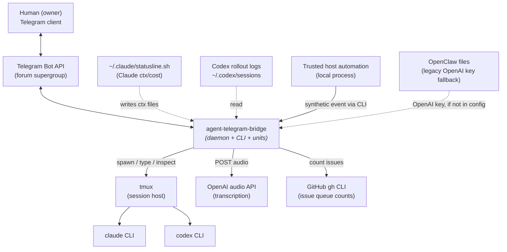
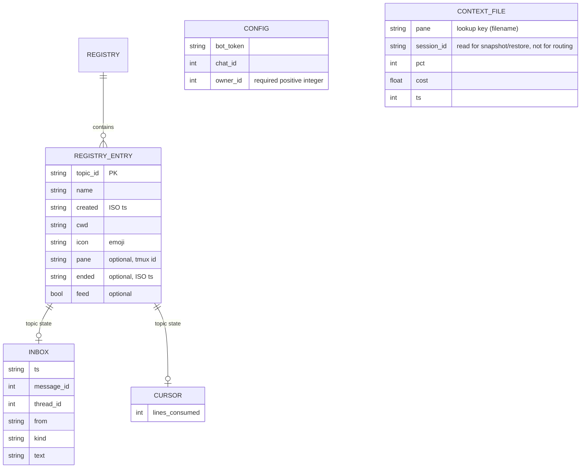
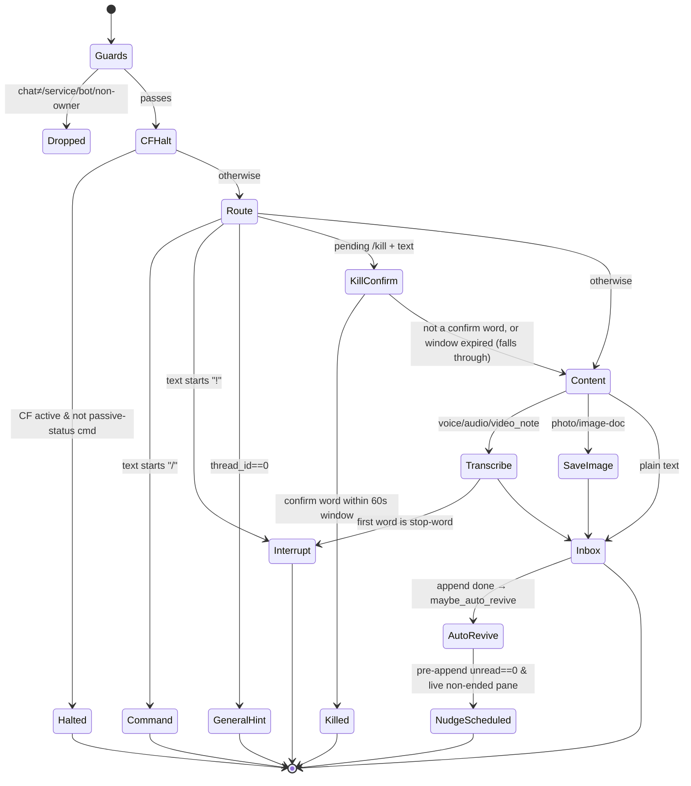
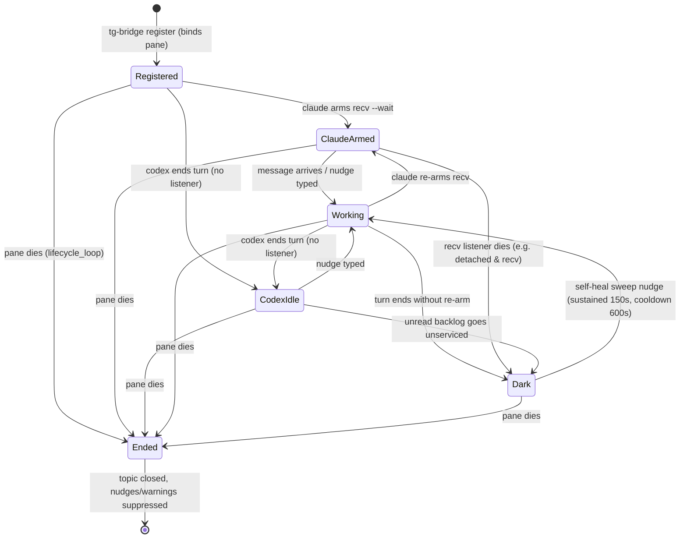
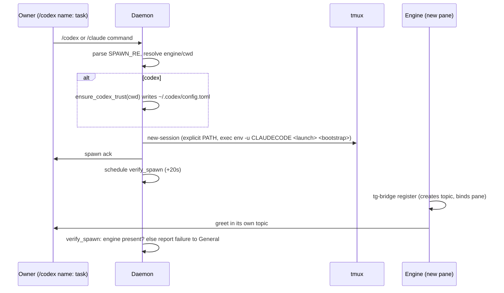

# agent-telegram-bridge — Specification

## Architecture Overview

The **agent-telegram-bridge** lets headless AI coding sessions (`claude` and `codex` CLIs running in tmux) hold a two-way conversation with a single human over one Telegram forum supergroup — one *session topic* per live session, voice transcribed and images downloaded. A single **daemon** is the sole Telegram `getUpdates` consumer: it routes inbound messages into per-topic inboxes, handles owner commands, spawns and monitors sessions, and renders a fleet dashboard. Each session drives its own side through the **`tg-bridge` CLI**. Secrets live only in chmod-600 config and an external OpenClaw config — never in code or logs.

**System context** — the external boundaries the bridge operates within:



The **human** interacts only through Telegram; **tmux** hosts the sessions the bridge controls; the **`claude`/`codex` CLIs** are launched but not implemented; **OpenAI** transcribes voice; the **statusline hook** and **Codex rollouts** are read-only context sources the bridge does not own; **GitHub** is queried read-only, through the `gh` CLI, for one status line of issue counts; **trusted host automation** may submit an idempotent synthetic event through the CLI (pull-only, no network listener).

For the full architecture — component boundaries, the design decisions and their rationale, the data-model overview, and key flows — see [`ARCHITECTURE.md`](./ARCHITECTURE.md). The numbered sections below specify the contract-level detail (schemas, CLI contracts, behavioral rules, and acceptance criteria with the observable check for each) that realizes that architecture.

## 1. Status

- **Document type:** implementation specification (contract-level detail).
- **Architecture:** [`ARCHITECTURE.md`](./ARCHITECTURE.md) — the system shape, decisions, and component boundaries. This spec realizes the single spec from that document's Spec Decomposition.
- **Provenance:** reverse-documented from source; the code is the authority, cited as `file:line`. There is no upstream PRD; acceptance criteria are derived from observed code behavior, not from inherited requirement IDs.
- **Verification:** cross-checked against the code by an independent Claude pass and an independent Codex pass; corrections from both are folded in.
- **Redaction:** secret values are never reproduced; only shapes and locations.

## 2. Scope

**In scope:** the daemon's inbound ingestion, command handling, session spawning, reboot restore, and monitoring loops (`daemon.py`); the `tg-bridge` CLI command contract (`cli.py`, `bin/tg-bridge`); the Telegram transport, outbound HTML formatting, and idempotency model (`common.py`); Codex context/usage derivation (`codex_ctx.py`); the model-identity watchdog (`model_watchdog.py`); the operator-driven reboot-restore CLI (`restore_cli.py`); the auxiliary services (`transcribe.py`, `digest.py`, `watchdog.py`); on-disk schemas; the session protocol; systemd configuration.

**Out of scope:** the `claude`/`codex` CLIs, tmux, the `~/.claude/statusline.sh` hook, the Codex rollout file format (consumed, not defined here), OpenAI's API internals, and the one-time MTProto group creation.

**Affected modules and files:**

```
bridge/daemon.py
bridge/cli.py
bridge/common.py
bridge/codex_ctx.py
bridge/model_watchdog.py
bridge/restore_cli.py
bridge/transcribe.py
bridge/digest.py
bridge/watchdog.py
bin/tg-bridge
skill/SKILL.md
systemd/agent-telegram-bridge.service
systemd/agent-telegram-bridge-watchdog.service
systemd/agent-telegram-bridge-watchdog.timer
systemd/agent-telegram-bridge-model-watchdog.service
systemd/agent-telegram-bridge-model-watchdog.timer
systemd/agent-telegram-bridge-digest.service
systemd/agent-telegram-bridge-digest.timer
```

**Requirement Coverage:** no upstream PRD exists, so there are no `REQ-`/`QB-` IDs to disposition. `unaccounted: []`. Traceability is to the source code (`file:line`) throughout.

## 3. Data Model



### 3.1 Config — `~/.config/agent-telegram-bridge/config.json` (chmod 600)

| Field | Type | Required | Constraints | Description |
|---|---|---|---|---|
| `bot_token` | str | yes | — | Telegram Bot API token (redacted). Embedded in the API URL (`common.py`). |
| `chat_id` | int | yes | shape `-100XXXXXXXXXX` | The forum supergroup id (redacted). |
| `owner_id` | int | yes | positive, non-boolean integer | Owner's Telegram user id. Missing or malformed configuration prevents startup. |
| `openai_api_key` | str | no | non-empty, no control characters | Enables voice transcription. **First** of three sources (§6.14). |
| `spawn_flags` | object | no | `{engine: str}` for `claude`/`codex` | Extra launch flags for spawned and revived sessions. **Absent means none** (§6.15). |
| `issue_queue` | object | no | `{owner: str, label_prefix: str}`, both non-empty | Adds the dashboard/digest work-queue line. **Absent means no line.** |
| `carry_forward_repo` | str | no | exactly one `/`, both halves non-empty | Target for the daemon-side fallback carry-forward issue. **Absent means no issue** — the file is still written. |

`load_config()` raises `SystemExit` if `bot_token`, `chat_id`, or `owner_id` is missing, or if `owner_id` is not a positive non-boolean integer. Unknown keys are ignored.

The two optional keys are read by callers that must tolerate what `load_config` rejects, so each treats every failure — a missing file, malformed JSON, **a top-level value that is not an object** (`true`, `7`, `null`, `[]`, a string), a document nested deeply enough to raise `RecursionError`, or a wrong-typed value — as "the key is absent", and neither lets the exception escape. The scalar case is not hypothetical: `json.load` accepts a bare `true`, so `load_config` raises `TypeError` from `key not in cfg`, and an uncaught one made every spawn and revive fail (#204 review).

### 3.2 Registry — `registry.json` (`common.py`)

A JSON object keyed by `str(topic_id)`. Written atomically (temp + `os.replace`), and every partial update goes through `update_registry()` under an exclusive cross-process file lock (`common.py`) so the daemon loops, Timer threads, and the separate `register` process can't lose each other's writes.

| Field | Type | Required | Description |
|---|---|---|---|
| `name` | str | yes | Topic title / task description. |
| `created` | str | yes | ISO timestamp (`now_iso()`). |
| `cwd` | str | yes | Registering session's `os.getcwd()`, then self-healed: `snapshot_once` (`daemon.py`) corrects it for a claude session whose transcript is not found there, using the launch cwd read out of the transcript itself (`transcript.launch_cwd`) and only when that value maps back to the file it came from. Needed because `claude --resume` is cwd-scoped, so a register-cwd ≠ launch-cwd session dies on every revive, and because the same field is the input to every `transcript_path()` reader, where a miss is silent (#78). Bounded by the snapshot cycle: an entry registered wrong whose host reboots before one cycle completes is still stranded on that first revive, and nothing is claimed about later attempts — `restore_on_boot` runs before any loop, and a revive that fails fast can be marked `ended` and skipped from then on. |
| `icon` | str | yes | Emoji from `ICONS`, or `📡` for feeds. |
| `icon_custom_emoji_id` | str | no | Telegram custom-emoji id (digits) for the **message** signature: `send_text` sends `icon` as that custom emoji on the first chunk (§6.8, #292). Set by hand; nothing else reads it. Distinct from the forum-topic icon, which is not stored under this name. |
| `pane` | str | no | tmux pane id; present only if registered with `TMUX_PANE` set (`cli.py`). |
| `ended` | str | no | ISO timestamp stamped by the daemon when the pane dies (`mark_ended`, `daemon.py`). |
| `feed` | bool | no | Event-feed topic: no pane, no warnings/nudges/lifecycle. |
| `engine` | str | no | `claude`/`codex`, stamped by `snapshot_once` (called every `SNAPSHOT_POLL` by `snapshot_loop`, `daemon.py`) while the pane is live. Consumed by reboot restore and `current-topic`. |
| `session_id` | str | no | The engine's conversation/thread id (claude `--resume` id or codex rollout uuid), stamped by `snapshot_once`. The evidence reboot restore resumes from (§5.4). |
| `boot_id` | str | no | Kernel boot id current when `engine`/`session_id`/`pane` were last stamped; the reboot gate (§5.4). |
| `briefed_boot` | str | no | Boot id for which a resumed pane was already briefed; a crash-retry idempotency marker for the restore briefing (`daemon.py`). |

The `pane` field is **first** written by the CLI `register` command; the daemon reads it at register time but **rebinds** it to the new tmux pane during revive (`_bind` → `update_registry`, `daemon.py,1892`). The daemon also writes `engine`, `session_id`, `boot_id`, and `briefed_boot`, and it both **stamps** `ended` on pane death (`mark_ended`) and **clears** it on revive (`daemon.py`).

### 3.3 Inbox record — `topics/<id>/inbox.jsonl` (`daemon.py`)

Append-only JSONL, one record per line.

| Field | Type | Constraints | Description |
|---|---|---|---|
| `ts` | str | ISO | Receipt timestamp. |
| `message_id` | int | Telegram ingress only | Telegram message id. A stable key a reader MAY use to dedup replays; the daemon does **not** dedup on it (see §7). |
| `thread_id` | int | Telegram ingress only | Topic id (`message_thread_id`). |
| `from` | str | — | `first_name or username or str(id)`. |
| `kind` | str | `text \| voice \| audio \| video_note \| photo \| image \| notification \| peer` | Content kind; the three audio kinds are transcribed. `notification` identifies trusted local automation; `peer` identifies another bridge session, whose identity is derived from its pane binding rather than supplied by the caller. |
| `text` | str | non-empty | Body; transcript for audio; for images the caption (if any) followed by the `[Image attached … : <path>]` note (`text = (caption + "\n" if caption) + note`, `daemon.py`). |
| `provenance` | str | local notification only | `local-notify`; backward-compatible provenance for a synthetic record. |
| `idempotency_key` | str | local ingress only, non-empty | Durable logical-event identity used to suppress repeat append/nudge/Telegram side effects. |
| `sender_topic_id` | int | `peer` records only | Topic id of the sending session, derived from its `TMUX_PANE` registry binding. Present only when the caller resolved to a dialog topic of its own. |

A record with empty `text` is never written (`daemon.py`). Telegram ingress writes the original six fields. Local ingress writes the normal reader-facing four-field core (`ts`, `from`, `kind`, `text`) plus `provenance` and `idempotency_key`, and for a `peer` record also `sender_topic_id`; readers already tolerate additional/missing provenance fields. A `peer` record's `from` is `"<sender topic name> (topic <id>)"`, composed from the registry — `--sender` cannot set it. The inbox record itself is the notification idempotency ledger—there is no second event state model.

### 3.4 Other state files (under `~/.local/share/agent-telegram-bridge/`)

| Path | Format | Role |
|---|---|---|
| `offset` | int | getUpdates ack cursor (highest `update_id` + 1). |
| `topics/<id>/cursor` | int | Read position; **unread = inbox line count − cursor**. |
| `topics/<id>/media/<message_id>.<ext>` | binary | Downloaded photos/image documents. |
| `dashboard.json` | `{message_id}` | The pinned dashboard message id. |
| `digest-snapshot.json` | `{ts_iso, costs, orchestra}` | Previous digest values for deltas. |
| `warnings.json` | `{topic_id: threshold}` | Context-warning high-water mark (`warning_loop`). |
| `autocf.json` | `{topic_id: bool}` | Auto-carry-forward armed/fired flag per episode (`warning_loop`, §6.6). |
| `autocf_exempt.json` | `[topic_id, …]` | Operator-set list of topics exempt from auto-carry-forward (#119); daemon-**read** only, hot-reloaded per poll (`daemon.py`). |
| `cf-unfinished/<topic_id>` | `<epoch> <token>` | Open from the moment a carry-forward starts until that same run reaches compaction. Left behind by a run that ends earlier — including one whose daemon was killed — and consumed by `_process_autocf` after `AUTOCF_RETRY_COOLDOWN` to re-arm auto-carry-forward (#239, §6.10). |
| `watchdog.json` | `{}` or `{down_since}` | Watchdog outage dedup state. |
| `model-watchdog.json` | `{session_id: {…}}` | Model-identity watchdog per-session state: claude keys carry `{last_fallback_ts, last_model}`, codex keys carry `{last_model, offset, file}` (§6.11). Also read by restore for the resume model (`last_model_for_session`, `daemon.py`). |
| `boot.json` | `{boot_id}` | Kernel boot id the daemon last baselined; the reboot-restore gate (§5.4). |
| `context/<pane>.json` | `{pane, session_id, pct, cost, ts}` | Claude context dump, written by the external statusline (read-only here). The bridge reads only `pct`/`cost` (and `ts` for staleness), keyed by `<pane>` filename; `session_id` is read for the snapshot/restore path (`context_session_id`) but not for message routing. |
| `tmp/` | scratch | Transient audio downloads. |

**Migration contract:** none — all state files are created on demand by `state_path()` (`common.py`); there is no schema versioning or migration step.

## 4. Interface Contract — the `tg-bridge` CLI

`bin/tg-bridge` execs `python3 bridge/cli.py "$@"`. The subcommand is required. `load_config()` runs before every command except the registry-only `current-topic`. Topic resolution for `send/recv/ask/typing` is `--topic` → `TG_BRIDGE_TOPIC` env → `./.tg-bridge-topic` file → error (`cli.py`); `notify` deliberately requires an explicit `--topic`.

| Command | Inputs | Outputs (stdout / exit / side effects) |
|---|---|---|
| `register` | `--name` (default `session <ts>`), `--bind`, `--feed` | **out:** `topic_id=<id>` + mode line. **side effects:** calls `createForumTopic`; writes a registry entry (captures `pane` from `TMUX_PANE` if set; `--feed` → `📡`, no pane); `--bind` writes `.tg-bridge-topic`. **exit:** 0; uncaught `PossiblyDelivered`/`RuntimeError` → traceback (no auto-retry — a retry would duplicate the topic). |
| `send` | `text` (positional; `-` = stdin), `--topic`, `--file PATH` (repeatable), `--as-document`, `--force` | **out:** `sent`, or a warning + `NOT resent`, or `NOT SENT —` + the unread records + the `recv` recovery line. **side effects:** emoji-prefixes, renders the Markdown subset to Telegram HTML and newline-aware-splits at 3800 chars (`_TG_HTML_LIMIT`), one `sendMessage` per chunk (§6.8) — **none at all** when refused. **exit:** **0 on success AND 0 on `PossiblyDelivered`** (deliberate — see §6.1); **3** when the topic has unread messages and `--force` was not given (#135); **4** when the topic is another live session's (§4.1a) — checked **before** the unread guard, so a foreign sender is never shown the target's records. The unread refusal previews the records **without** advancing the cursor, so `recv` remains the only cursor writer. Feed topics are exempt (nobody drains them). |
| `recv` | `--topic`, `--wait N`, `--peek`, `--json` | **out:** unread records; on a `--wait` timeout `(no reply within timeout)`; with **no `--wait` and nothing unread**, prints nothing. **side effects:** only when records are found **and** not `--peek`, prints/flushes them, then commits the cursor under the inbox lock only if no writer added a line; additions are drained before retrying. It then fires a typing indicator. An empty result and the `--peek` path do neither. **exit:** **0** = records printed, **or** no-wait with nothing unread (prints nothing, exit 0); **2** = `--wait` elapsed with nothing; **4** = another live session's topic on the cursor-committing path (§4.1a). `--peek` is exempt from that guard: it moves no cursor. |
| `ask` | `text` (positional), `--topic`, `--timeout N` (default 300), `--json` | Drains backlog to a stable cursor → sends → blocks for a reply → prints it, drains any racing additions, commits cursor, fires typing. **exit:** 0 = reply; 2 = timeout; **4** = another live session's topic (§4.1a), refused **before** the initial drain, so the target keeps its backlog and cursor. On `PossiblyDelivered` it warns (stderr) and waits anyway, without resending. |
| `typing` | `--topic`, `--seconds N` (default 5) | Loops `sendChatAction(typing)` every 4 s until the deadline. **exit:** 0 (best-effort; send errors swallowed). |
| `current-topic` | `TMUX_PANE` environment | Validates exactly one local, live, non-feed, non-ended registry binding. **out:** one JSON object with fixed keys `topic_id`, `name`, `pane`, `engine`, `cwd`. **exit:** 0 on one live binding; non-zero with a clear error for missing `TMUX_PANE`, missing/feed/ended/ambiguous bindings, pane timeout, or dead pane. Loads no bot config and has no side effects. |
| `notify` | stdin body; required `--topic N`, `--idempotency-key KEY`; `--sender LABEL` required only when the caller has no dialog topic of its own | Resolves the **caller's** own topic from `TMUX_PANE` (registry plus a bounded pane-liveness probe; any failure means "unknown caller", i.e. the automation path), then validates the target live dialog before side effects. Under an inbox lock, durably appends one record and fsyncs it — `peer` with derived `from`/`sender_topic_id` for a session caller (`--sender` ignored), `notification` with the free-text `--sender` otherwise — and fsyncs `topics/<id>/` when that append creates the inbox file (§6.4). If this is the first unread record, injects only the normal recv cue through bounded tmux. It then mirrors through `common.send_message` **directly, not `send_text`** (whose icon prefix is the *target's* signature): `<sender icon> <sender label>: <text>` for a peer, un-iconed `<sender>: <text>` for automation. It then posts a Telegram-only outbound echo `→ <target label>: <text>` into the **caller's own** topic, signed with the caller's icon — skipped for automation and for a self-notify, run after the target mirror, and never raising. **out:** stdout carries **only** the machine-readable JSON result — `enqueued` with wake/Telegram/echo status, or `duplicate`; the shared nudge primitive and the Telegram-degraded warning both go to **stderr** so stdout stays parseable as JSON (#131). **exit:** 0 after durable local enqueue even if Telegram is `ambiguous`/`failed`; invalid input/topic/pane is non-zero before inbox/tmux/Telegram effects. A duplicate key performs none of those three effects. |
| `status` | (none) | Prints daemon `systemctl --user is-active` state + every registry topic with live unread counts (read-only). **exit:** 0. |

There is no `peek` subcommand — "peek" is the `recv --peek` flag only.

### 4.1a Topic-ownership guard (`require_own_topic`, exit 4)

`send`, `ask`, and cursor-committing `recv` refuse a topic that belongs to another live session. The caller's own topic is resolved by the same rule as `current-topic`: `TMUX_PANE` against the registry, then a bounded pane-liveness probe — a set `TMUX_PANE` does not prove the process is still in that pane (a detached script keeps the value it inherited, and a dead pane's registry entry stays live until the lifecycle sweep's next poll). The refusal prints the equivalent `notify` command and exits 4 before any Telegram call, drain, cursor commit, or unread preview. The refusal text is per-command, because the damage differs: `send` posts without consuming, `recv` consumes without posting, `ask` does both.

Exempt by construction: the caller's own topic; feed, ended, and unregistered targets; `recv --peek`; and any caller whose topic cannot be resolved — no `TMUX_PANE`, unregistered pane, ambiguous binding, dead pane, or a tmux timeout/error, all of which resolve to "unknown caller" so a hung tmux degrades to unguarded rather than breaking every command. That keeps cron jobs, external orchestrators, and other headless callers working and gives an operator the deliberate escape `env -u TMUX_PANE tg-bridge …`. This is a tripwire against a known mistake class, not a security boundary: filesystem/process access to the bridge user already permits `tmux send-keys` into any pane.

## 5. State & Lifecycle

### 5.1 Inbound message routing (`handle_message`, `daemon.py`)

Guards run first (drop unless `chat.id == chat_id`; drop service messages, bots, and every sender other than the mandatory `owner_id`). The outer Telegram message sender is authoritative even for forwarded content. The routing text is `message.text or message.caption or ""`. Before the precedence below, a **carry-forward kill-switch** runs: while a daemon-driven carry-forward is auto-driving this topic, any inbound message that is **not** a read-only passive-status command (`/ctx /help /sessions /usage /peek`) halts the flow and is consumed (not delivered) — see §6.6. Then precedence (first match wins):



`maybe_auto_revive` (`daemon.py`) fires after the append: an inbound message to an `ended` topic that still carries a `session_id` (not a feed) triggers a one-shot background revive of that session before the nudge is scheduled (§5.4).

### 5.2 Session liveness lifecycle

A bound session is tracked by its registry entry and pane. States and transitions:

Claude and Codex reach the between-turns state differently: Claude **arms a real `recv --wait` listener** (a live process holding the wait), while Codex **holds no listener at all** — it ends its turn idle and depends entirely on the daemon's nudge to wake (see §6.4). The diagram models these as two distinct idle states.



- **ClaudeArmed vs CodexIdle:** `ClaudeArmed` is a Claude pane holding a live `recv --wait` listener; `CodexIdle` is a Codex pane that has ended its turn with **no listener running** (Codex cannot hold a background wait, so it is nudge-driven — §6.4). Both are "waiting on the owner," but only Claude has a process armed to consume the reply.
- **Dark detection** (`idle_sweep_loop`): a pane is dark when it has an `unread` backlog (either engine) OR (claude only) an empty inbox + no live `recv` process + idle pane. Codex is excluded from the dead-listener case because it never holds a recv listener — its only dark flavor is an unserviced `unread` backlog.
- **Ended** is terminal: `lifecycle_loop` stamps `ended`, posts a notice, and calls `closeForumTopic`; the `ended` flag then suppresses all nudges, warnings, and sweeps.

### 5.3 Spawn lifecycle (`spawn_session`, `daemon.py`)



### 5.4 Reboot restore, snapshot, and manual revive (#74)

A reboot kills every tmux pane, so every session dies and `lifecycle_loop` closes the topics. Three mechanisms recover them:

- **Snapshot** (`snapshot_loop`, `daemon.py`, every `SNAPSHOT_POLL` = 60 s): while a pane is alive it stamps `engine`, `session_id`, and the current `boot_id` into each live, registered, non-ended, non-feed registry entry — writing only on change. This is the only moment a codex pane maps to its rollout exactly (via its open fds; `session_id_for_pane`, `daemon.py`), so restore never has to infer engine/session at reboot time.
- **Auto restore on boot** (`restore_on_boot`, `daemon.py`): runs **once at daemon start, before any loop or getUpdates**, and only when the kernel `boot_id` (`/proc/sys/kernel/random/boot_id`) differs from the baselined one in `boot.json` — a genuine reboot, not a mere daemon restart. It revives each live-at-reboot session (`revive_one`): resume the exact conversation (`claude --resume <sid> --model <last_model>` — model from `model-watchdog.json`; `codex … resume <sid>`), reopen the topic (`reopenForumTopic`), rebind the new pane, and — once the pane is up and idle — inject a restore briefing (Claude re-arms its `recv`; Codex is nudge-driven). A session with no `session_id` reopens **fresh** (prior context lost). Migration edge: `boot.json` absent **and** all target panes dead is treated as an unbaselined reboot and restored (`_all_target_panes_dead`, `daemon.py`).
- **Auto-revive on message** (`maybe_auto_revive`, `daemon.py`): an inbound message to an `ended`, non-feed topic that still carries a `session_id` triggers a single background revive of that session (deduped by `_auto_reviving`), so the owner writing to a dead topic brings it back.
- **Manual restore CLI** (`restore_cli.py`): `python -m bridge.restore_cli` is the operator-driven path, **independent of the boot gate and of the `ended` flag** — for deliberately reviving already-`ended` reboot victims. `--topics <ids>` resumes (session_id resolved from each topic's old statusline context file; claude only), `--fresh <ids>` reopens without resume, `--codex <topic>:<uuid>` resumes a codex session with an explicit verified id, `--list` prints revivable topics with resolved session ids. It calls `daemon.revive_topics` (`daemon.py`) and exits non-zero if any revive `failed`.

## 6. Behavioral Rules

### 6.1 Send idempotency classification (`api()`, `common.py`)

The core rule: **a write whose acknowledgement is lost must never be auto-retried.** Each failure is classified by one question — did the request provably never reach Telegram?

- `IDEMPOTENT_METHODS = {getUpdates, getMe, getFile, getChat, sendChatAction}`. All others (`sendMessage`, `createForumTopic`, …) are writes.
- `_never_delivered(exc)` is true only for `ConnectionRefusedError` or `socket.gaierror` (DNS) — the connection was never established.

| Failure | Action |
|---|---|
| HTTP error response (Telegram answered) | parse body; surface — outcome known, no duplicate risk. |
| `_never_delivered` true (refused / DNS) | three total attempts (`retries=3`), sleeping 0.3 s after attempt 1 and 0.6 s after attempt 2 (backoff `0.3·(attempt+1)` s); if all three fail, raise `RuntimeError`. |
| Post-connect failure (`URLError`/`TimeoutError`/`ConnectionError`, not refused/DNS), **idempotent** method | raise plain `RuntimeError` — the caller may retry a no-op. |
| Post-connect failure, **non-idempotent** method | raise **`PossiblyDelivered`** — the write may have landed; the caller MUST NOT auto-retry. |

On an HTTP 200 carrying `ok: false`, `api()` raises `RuntimeError` with the Telegram error code and description (`common.py`) — an application-level rejection, distinct from the transport failures above.

`PossiblyDelivered` propagates to `tg-bridge send` (prints `NOT resent`, exits 0) and `tg-bridge ask` (warns, waits without resending). Tradeoff: under extreme slowness a send may be silently dropped rather than duplicated.

### 6.2 IPv4 pinning (`common.py`)

On import, `socket.getaddrinfo` is wrapped to return only IPv4 (A) records for hosts ending `telegram.org` (other hosts untouched). `api.telegram.org` over IPv6 is unreachable from this host; pinning prevents requests parking on the dead route. The wrapper is idempotent (guards against double-wrapping).

### 6.3 Idle nudge gates (`maybe_nudge` `daemon.py`, `schedule_nudge` `daemon.py`)

A daemon nudge is scheduled only when the shared append critical section returns a wake claim for the Telegram record that created the first unread item and the topic has a registered, non-ended pane. The claim carries the append-time cursor generation. After `NUDGE_DELAY` (4 s), dispatch takes the wake-transition lock and sends only if that generation is still current, the inbox is unread, and the pane is alive — the delay lets a blocking `recv --wait` consume the reply first without allowing the old owner to nudge a later batch. The wake-line is `[tg-bridge] For the session registered on topic <id> (session <sid>); other agents in this terminal ignore this. New Telegram message in your topic — run tg-bridge recv --topic <id> and act on it.` The address comes first, and `nudge_address` (`daemon.py`) puts the same opening on every injected line that tells a session to run `recv` (the message nudge and both `sweep_nudge_text` flavors). A session's subagents share its pane and read what is typed there; one obeyed a nudge, consumed its owner's message and re-posted it (#145). This is **addressing, not a guard** — it cannot stop a subagent, and no read can: owner and subagent share a pane, a process tree and an environment, and the identity-looking variables Claude Code exports are inherited from whatever launched the pane rather than set per session (measured across six live topics, all reporting one id matching none of their registry ids). The session id is carried in full so a later transcript-side check can match it exactly.

`notify` runs in a separate CLI process, validates pane liveness before persistence, and invokes the same `maybe_nudge` primitive immediately after the first unread record is fsynced. It passes the wake claim; a stale claim is reported as `already-unread` without pane injection. The primitive injects only that wake-line plus Enter; it never injects the event body. Every tmux call passes through `_tmux`, whose 10-second default timeout prevents a hung tmux server from blocking indefinitely. Existing unread content suppresses another claim because the pane has already been cued for that batch.

**Wake semantics.** `wake: nudged` means only that tmux accepted the cue keystrokes; it is **not** evidence that the agent read or acted on the record, and no acknowledgement exists anywhere in the system. That is why `notify` reports `enqueued` rather than `delivered`. After enqueue the observables are the target's unread count (`status`) and the idle sweep's recovery nudge (§5).

### 6.4 Local notification idempotency

Normal Telegram ingress and `append_jsonl_once` take the same exclusive per-inbox writer flock and read the inbox line count plus cursor while holding it. The local helper additionally scans for the supplied `idempotency_key`, then either returns duplicate or appends and fsyncs one record. The append path that creates the first unread record returns a `WakeClaim` containing that cursor generation; other new records return no claim. This makes concurrent same-key retries resolve to one append and concurrent local or mixed-source events resolve to one wake owner. The winning local command validates its claim, wakes, and mirrors only after the durable commit. A retry with the same key returns duplicate before either side effect, including when the first Telegram result was ambiguous or failed. A different key is a new logical event and remains deliverable.

**Durability claim.** The append flushes and fsyncs `inbox.jsonl` before any side effect, which covers the observed failure class exactly: a sender process that dies after exit 0 cannot lose the record. That is the whole claim — **process-crash durability with a fsynced file; no OS-crash pathname guarantee**. When the durable append is the call that creates the inbox file, `topics/<id>/` is fsynced once as well; this is partial hardening with nothing attached to it, because every ancestor of that directory may have been created by a writer that syncs nothing (`state_path`'s `makedirs`, the non-durable Telegram ingress append), so an existing pathname is not a persisted one and no append-time check can tell the two apart.

The sole foreground reader emits and flushes records without holding either lock, preserving durable-before-cursor ordering. It then takes the wake-transition lock followed by the writer lock and advances the cursor only when the inbox line count still equals the emitted cursor. If a writer appended in the gap, the commit fails, the reader drains and flushes the added lines, and it retries. Wake dispatch takes only the transition lock, validates the claim generation, then performs bounded tmux. Consequently cursor advancement cannot make an old wake owner act on a later batch, while inbox writers are never held behind tmux.

### 6.5 Self-heal sweep gates (`idle_sweep_loop`, `daemon.py`)

Per topic per 60 s pass, after skipping ended/feed/dead-pane/unknown-engine topics:

- Classify dark flavor: `unread` (unread > 0, both engines) or `dead-listener` (claude only: unread == 0 AND no live recv AND pane idle).
- **Sustained-dark gate:** act only after the topic has looked dark ≥ `SWEEP_GRACE` (150 s).
- **Cooldown gate:** at most one nudge per topic per `SWEEP_COOLDOWN` (600 s).
- **Listener detection** (`has_live_recv`, `daemon.py`): `pgrep -af "tg-bridge recv --topic <tid>"`, then boundary-match with `tg-bridge recv --topic <tid>(?:\D|$)` so topic 6 ≠ 606. Returns "unknown" (None) on error → no nudge.
- **Idle detection** (`pane_is_idle`, `daemon.py`, via `_cf_busy`, `daemon.py`; timer regex `_CF_SPINNER_TIMER_RE`, `daemon.py`): a pane is idle when its last 25 lines carry **no** live-turn signal — the live spinner elapsed-timer (`_CF_SPINNER_TIMER_RE = …[ \t]*\(\d+[hms]`, anchored on the ellipsis plus the **first** time unit so it matches every rendering: `…(9s`, `…(4m 18s`, `…(1h 2m 3s`), the compaction bar `▰▱`, or the legacy `esc to interrupt` footer. Current Claude Code no longer renders `esc to interrupt`, so the spinner timer is the real signal; relying on the footer alone read an active turn as idle. The timer was seconds-only until #181 — Claude Code switches it to minutes past 60 s (and hours beyond) — so any turn running ≥ 1 min read as idle, inverting every gate built on `pane_is_idle`/`_cf_busy` exactly for the long turns worth not interrupting (mid-turn nudge injection, auto-`/compact`, the revive briefing); the same regex is the live-signature half of `_cf_line_is_compacting`, so a compaction past 60 s was equally invisible. Errs toward "not idle" on any capture error.
- **Nudge dispatch** (`sweep_nudge_text`, `daemon.py`): `unread` tells the session to drain + re-arm; `dead-listener` re-delivers the last inbox record as a recap **only if** it was written within `RECENT_DROP_WINDOW` (1200 s) — a drop by a just-died listener is fresh, so an old already-handled message isn't re-injected on every sweep (#105).

Three nested try/except layers (per iteration / per topic / per send) guarantee a sweep fault never crashes the daemon.

### 6.6 Command dispatch (`handle_command`, `daemon.py`)

Commands handled by the daemon (not passed through verbatim): `/help`, `/sessions`, `/usage`, `/ctx`, `/peek`, `/stop`, `/kill`, `/model`, `/carryforward` (aliases `/cf`, `/carry [forward]`), `/claude`, `/codex`, `/spawn`. Of these, several **do act on the bound pane**: `/peek` reads it (`capture-pane`), `/stop` sends `Escape` to it, `/kill` (after a 60 s `yes`/`да` confirmation) kills it, and `/model <alias|id>` switches the session's model live once the pane is idle (`handle_model`, `daemon.py`; idle-gated with bounded retries, then clears the "Switch model?" confirm dialog). Any **other** `/command` is typed verbatim into the pane; with no live pane the daemon replies it cannot deliver it. Both that relay and `/model` go through `type_line`, so Enter is pressed only once the text is confirmed in an input box, and a non-`sent` result is reported to the topic as a failure rather than as the command having been delivered — before #154 they were raw `send-keys` + a blind `Enter`, and `pane_is_idle` is satisfied by any modal, so a swallowed command's `Enter` answered that modal's default (for the rate-limit picker, a cheaper model) while the daemon replied that it had switched. `/model`'s reply states what was delivered, not what the session did with it; the dialog-confirming Enter stays raw because it answers a dialog matched on the **visible** pane (both its title and an option line), which narrows but does not close the #269 class. `/ctx` branches on engine (Claude statusline vs Codex rollout); bare `/usage` does not — it reports BOTH account meters in one message (Claude statusline cache and the newest Codex rollout, account-wide), every window as remaining % with its reset time, and a source with no snapshot says so in place while the other line still shows. `/usage claude` / `/usage codex` return only that line, `/usage codex` from a Codex topic scoping to that session's rollout (#795). All daemon replies are `⚙️`-prefixed.

**`/carryforward` (daemon-driven, #85):** because the model cannot `/compact` itself, `/carryforward` (and its aliases) is intercepted **before** the verbatim passthrough (`is_carry_forward_command`, `daemon.py`) and drives a per-topic background worker end-to-end: WRITE (inject a non-interactive prompt so the session writes a dense carry-forward to a daemon-chosen file and records it to a GitHub issue, signalled by a done-marker) → COMPACT (`/compact`, clear the modal, confirm compaction actually started **and finished**) → RESUME (nudge the session to re-read the file and continue). While that stretch runs, a **kill-switch** (`carry_forward_active`/`halt_carry_forward`) makes any redirect message from the owner (plain text, `/stop`, `/model`, a new task) halt it (`Escape` + consume the message); the read-only passive-status commands `/ctx /help /sessions /usage /peek` are exempt (#87). `warning_loop` also fires the same procedure automatically for a Claude session that crosses `AUTOCF_PCT` context (§6.10), unless the topic is in `autocf_exempt.json` (#119).

**PHASE 2's ground truth is the session transcript, not the pane (#157).** A `transcript.cursor()` is taken immediately **before** each `/compact` injection, and the answer comes from `transcript.compact_events()` over the records appended after it: a `system`/`local_command` record carrying the hook's stderr is the refusal (reported verbatim, no retry), a `user` record holding `<command-name>/compact</command-name>` is the command having reached the session, and `isCompactSummary` is compaction having finished. Submission is **not** treated as completion. Freshness is structural rather than argued — records after a cursor — which is what replaces the pre-injection pane snapshot, its occurrence multisets and the append-and-scroll reasoning they rested on (#155); a pane that merely *displays* an old refusal cannot write a record. A refusal is honoured in **both** windows: the hook's record can land after the `/compact` user record, so the start gate legitimately sees a submission and the refusal appears only during the completion wait. Transcript-confirmed completion is then followed by `_cf_wait_idle` before PHASE 3 — `isCompactSummary` says compaction finished, not that the TUI has finished drawing, and PHASE 3 types into that pane. The pane path (`_cf_wait_compacting`, `_cf_hook_block_reason`, `_cf_wait_idle`) is unchanged and still runs where the transcript cannot answer: a codex pane, a stale `session_id`, or a `records_since` result of `UNKNOWN` — an untrusted absence is never read as "nothing happened". `PENDING` is used rather than fallen back on: a mid-write tail makes absence unprovable but not presence, and every decision here acts on a record being present. **What the cursor establishes is novelty, not authorship** — the records carry no id tying them to this injection, so a `/compact` the owner types after the cursor is indistinguishable from the daemon's; and what each record supports is narrower than "a compaction is running" — `submitted` says the command reached the session, `completed` says one finished, neither says which injection it answers. When compaction is confirmed but the pane never settles, the owner is told exactly that rather than "compaction didn't settle", which would be false about a thing that provably happened.

### 6.7 Spawn rules (`spawn_session`, `daemon.py`)

- Every **newly created** pane — a spawn, or a revive that has no matching tmux session to reuse — is launched through `launch_pane` with a hardened `PATH`, `CLAUDECODE` scrubbed from the environment, and `SPAWN_ENV` (`CLAUDE_CODE_DISABLE_BG_SHELL_PRESSURE_REAP=1`, #178) set for the engine process. `revive_one` binds to an existing session when one matches (its `existing` branch) without relaunching, so that engine keeps whatever environment it was started with.
- `/claude` and `/spawn` → claude engine; `/codex` → codex engine. The command is built by `engine_launch`, which takes its flags from `spawn_flags` in the config and defaults to **none** (§6.15). The claude model is pinned explicitly (`--model <SPAWN_MODEL>`, default `claude-opus-4-8[1m]`, env `TG_BRIDGE_SPAWN_MODEL`) rather than riding the account's implicit default — a deprecated default breaks every spawn at once, as the Fable-5 disablement did.
- Abort if the cwd is missing or a tmux session of that name exists.
- Codex only: pre-write `[projects."<cwd>"]\ntrust_level = "trusted"` to `~/.codex/config.toml` if absent.
- Launch with an explicit PATH including `/home/linuxbrew/.linuxbrew/bin` (a systemd-inherited minimal PATH would kill the pane with exit 127); `exec env -u CLAUDECODE` makes the engine the pane root and strips the nested-session guard.
- The daemon unit uses `KillMode=process` so restarting the bridge kills only the Python daemon, not the tmux server or panes spawned from `/claude` and `/codex`.
- Verify at +20 s (`SPAWN_VERIFY_DELAY`); on failure report to General with a pane tail.

### 6.8 Emoji signature, icon assignment & outbound HTML (`cli.py, 107-114`; `common.py`)

`send_text` prepends the topic's registry `icon` to every message (one bot account → the emoji is the signature). `pick_icon` returns the first of a 16-emoji palette not in use by a non-ended entry; on exhaustion it falls back to `ICONS[topic_id % 16]`. Feed topics are pinned to `📡` and never consume a palette slot.

Outbound text goes through `common.send_message` (#89): a conservative Markdown subset (`**bold**`, `__underline__`, `~~strike~~`, inline/fenced code, `[text](url)`) is rendered to Telegram HTML (`parse_mode=HTML`) by `md_to_telegram_html`, with `& < >` escaped first so literal angle-bracket tokens can't be dropped as tags; single-char `*`/`_` italic is deliberately not converted. Text is split by `split_for_telegram` at `_TG_HTML_LIMIT` = **3800** chars — **newline-aware** (prefers line boundaries; hard-splits only a single over-long line) and lossless (joining the chunks reproduces the input). One `sendMessage` per chunk, and on an HTML parse error the offending chunk is re-sent as plain text so a formatting edge case degrades a message, never drops it. Because the icon is prepended before splitting, only the first chunk carries the emoji.

A topic whose registry entry carries `icon_custom_emoji_id` (digit string) gets that icon sent as a Telegram **custom emoji**: `send_message` wraps the first chunk's leading icon as `<tg-emoji emoji-id="ID">icon</tg-emoji>` **after** `md_to_telegram_html` ran on that chunk (#292) — before conversion the tag would be escaped and sent as literal text. The plain icon stays the entity's fallback text, so chunks 2+, the plain-text fallback, `verbatim` sends, file captions, and every reader of the registry `icon` are unchanged. A non-digit value is ignored with a line on stderr (`cli.custom_emoji_id`).

### 6.9 Codex context/usage derivation (`codex_ctx.py`)

- **Context %** (`ctx_pct_for_pane` → `rollout_for_pane`, `codex_ctx.py, 310-330`): a live Codex pane is matched to its **own** rollout through the pane process tree's **open file descriptors** — the exact answer, since a live codex process holds its rollout open and this survives a resumed session's id going stale. The launch-`cwd` lookup (newest rollout whose first `session_meta` records that cwd) is a **fallback used only when it is unambiguous** — exactly one root (non-sub-agent) thread launched in that cwd — otherwise it returns None, because a sub-agent thread writes its rollout in the parent's cwd and would otherwise be reported as the pane's occupancy (#123). The `%` is `round(100 · info.last_token_usage.input_tokens / info.model_context_window)` from the **last** `token_count` event (`ctx_pct_from_rollout`, `codex_ctx.py`).
- **Usage** (`usage_for_cwd`/`usage_latest` → `_usage_from_rollout`, `codex_ctx.py`): account rate limits are account-scoped, so these read the newest rollout (for a cwd, or account-wide) that carries a **non-empty** `rate_limits` — the last `token_count` event that has one (`info`-only events are skipped, `codex_ctx.py`): `rate_limits.primary` and `rate_limits.secondary`, each with `used_percent`, `window_minutes`, `resets_at`, plus a **top-level** `rate_limits.plan_type`. The daemon's `codex_usage_line` labels each window from its actual `window_minutes` (5h / weekly / …), not from the primary/secondary slot (#103).

### 6.10 Context warnings & auto-carry-forward (`warning_loop`, `daemon.py`)

Every 30 s, for each pane's highest-id non-feed topic, warn when occupancy crosses a 10% band at or above 20%. The high-water mark persists in `warnings.json`; if occupancy drops (compact/clear), the mark resets so growth re-warns. **Codex panes are skipped entirely** — Codex self-manages context, so it gets no warnings and no auto-carry-forward, and any leftover warn/auto-cf state for the topic is cleared so a later Claude reuse re-arms cleanly (`daemon.py`). Engine is resolved from the live fleet (`engine_of_pane`); an unknown engine stays on the Claude path. Occupancy for Claude comes from the statusline via `context_for`.

The same loop drives **auto-carry-forward** (#92, `_process_autocf` → `_autocf_decide`, `daemon.py`): when a Claude session first crosses `AUTOCF_PCT` (default 60 %) it fires the full daemon-driven carry-forward procedure (§6.6), staying armed until occupancy falls below `AUTOCF_REARM_PCT` (default 50 %) to avoid flapping. Topics listed in `autocf_exempt.json` (#119, hot-reloaded per poll) never fire.

**Retry after a run that never compacted** (#239): only a post-compaction drop below `AUTOCF_REARM_PCT` clears the armed flag, so a carry-forward that ends earlier — the session stayed mid-turn, the pane died, `/compact` never took, the worker raised, the daemon was killed — would leave the topic armed with nothing left that could ever unarm it, and auto-carry-forward would be finished for the life of that session.

`handle_carry_forward` therefore opens a record, `cf-unfinished/<topic_id>`, at the moment it launches a run, holding that run's start time and token; a run whose record cannot be written does not start. The run closes it on the line where its compaction is confirmed — not on the way out, so that a daemon killed during the resume that follows cannot leave an open record for a run that demonstrably compacted. Every earlier return, the exception path and `SIGKILL` leave it open, which is the honest state: nobody observed that run compact. What survives a daemon restart is a record written by the run itself, before the worker existed, rather than a guess made afterwards from an armed flag that cannot tell a dead run from a finished one.

`_process_autocf` consumes the record and clears the armed flag once `AUTOCF_RETRY_COOLDOWN` (15 min) has passed since the run started, and only while no carry-forward is running for the topic — a live run's record is open by design. Consuming it is what bounds the retry: one further attempt per run that did not finish, not one per poll, which matters because the sessions that miss the settle window are the busy ones and a busy session would miss it again on the next tick. Reaching compaction means a compaction-specific signal was seen and the pane then settled — the evidence the flow already requires before auto-resuming; occupancy is **not** read, so closing the record says the run compacted, not that occupancy fell below the re-arm point.

Matching on the token is what keeps two runs from reporting for each other: a halt frees the topic while the halted worker is still unwinding, so a newer run can open its own record first, and an older worker arriving late must not close it. The warning loop's own closes — consuming an aged record, and the three cleanup branches — carry no token, because the loop is not a run. All of them, and the opens, are serialised on one in-process lock, since read-then-unlink is not a single filesystem operation and the daemon is the only writer of this directory. The record is per-topic auto-carry-forward state and is dropped wherever the armed flag is — topic closed in Telegram, engine resolved as codex, topic exempted — since otherwise a reopen or un-exemption would meet a stale record and fire on the next tick with the cooldown bypassed.

### 6.10a Mass restore resumes large sessions from summary (`_restore_targets_now`, `revive_one`, `daemon.py`, #277)

On the message-revive path the owner is present and is asked compact-vs-full (§6.x, #195). On **boot and recovery restore** nobody is at the terminal, and the previous default — leave Claude's own resume picker unanswered and come back in full — re-read a ~350k-token session twice as fresh cache writes on the most expensive model, for a session that then sat idle all day.

`revive_one(auto_summary=True)` therefore answers that picker with **"Resume from summary"** when, and only when, the session will actually be resumed (not spawned fresh), is `claude`, and is above Claude Code's *own* picker thresholds (`resume_picker_expected`: larger than `RESUME_MODAL_TOKENS` **and** older than `RESUME_MODAL_AGE_MINUTES`). Above those thresholds the prompt cache has long expired, so the full re-read buys nothing the summary does not. An explicit `resume_choice` from a caller always wins.

The decision is taken **inside** `revive_one`, after `do_fresh` is known, because a fresh spawn renders no picker and a choice passed into one would trip the "you chose X but the picker never appeared" warning on every reopened session. Size and age come from one `session_cost_sample`, for the reason `_needs_asking_for` records — read separately, the halves can disagree. A failure to read either degrades to "no automatic choice": a cost optimisation must never turn "resume in full" into "did not come back at all".

**Bounded.** Answering a picker waits for it to render, so N large sessions could each add `RESUME_MODAL_WAIT` before the daemon polls at all. `_restore_targets_now` sets **one** `RESTORE_PICKER_BUDGET` (300 s) for the whole restore and passes `min(now + RESUME_MODAL_WAIT, budget)` as each `answer_resume_picker` deadline — the parameter existed and had never had a caller. Each session still gets its full per-session wait until the budget is spent; after that the rest are **not opted in at all** — with less than `MIN_PICKER_WINDOW` left, `answer_resume_picker` would return without looking at the pane, so claiming `compact` would leave a rendered picker unanswered (the dark-session bug that machinery exists to prevent) while telling the owner "you chose compact", a choice they never made. Declining restores the pre-#277 path exactly: no claim, and the honest "I have no answer from you" report if a picker does appear.

The early check decides only whether the session **qualifies**; the choice itself is taken as late as it can be, immediately before the picker call. That placement is not what makes it safe, though — review found three different steps between the check and the call (sizing, the pane launch, a flushing `log()`), and there is always one more. What makes it safe is that a choice the **daemon** made is never reported as the owner's: `auto_chosen` splits the two, the loud "you chose X but the picker never appeared" warning is reserved for a choice the owner actually made, and a picker left up by an unlanded automatic choice is reported as an unanswered picker — the same wording, `UNANSWERED_PICKER_NOTICE`, as when there was no answer to give at all. What is reported depends on the state of the pane, not on what consumed the budget. Queued Telegram messages are not lost meanwhile (the poll is offset-based). The restore summary counts and **names** the sessions resumed from summary, since the saving — and a wrong call — are invisible otherwise.

### 6.11 Model-identity watchdog (`model_watchdog.py`, #121)

A **standalone systemd-timer target** (`sweep(load_config())`, `model_watchdog.py`), **not** a daemon thread — it reads the registry and engine transcripts but does not need the bridge daemon running. It alerts a session's own topic when its model silently drifts. Per sweep it selects the latest (highest-id) non-feed, non-ended topic per live pane (mirroring `warning_loop`), then, by engine:

- **Claude** (`check_transcript`, `model_watchdog.py`): resolve `session_id` from the pane's statusline context file, then read the tail (`TAIL_BYTES` = 2 MB) of `~/.claude/projects/<flattened-cwd>/<session_id>.jsonl`. **First sight baselines** (store `last_model` + `last_fallback_ts`, no alert). Thereafter it posts one **fallback alert** per *new* `system`/`model_refusal_fallback` event, and one **transition alert** when the last non-`<synthetic>` assistant `model` differs from the stored one.
- **Codex** (`check_codex` → `check_codex_rollout`, `model_watchdog.py`): resolve the rollout via the pane process-tree's **open fds** (fallback to the registry `session_id`; **no** cwd fallback — a wrong file is worse than none), key state on the rollout's own thread uuid, and read `thread_settings_applied` events **incrementally from a stored byte offset**, with a `(device, inode)` file-identity guard that re-baselines on a swap/truncate. A settings event younger than `CODEX_SETTLE_SECONDS` (5 s) — and the rest of its `CODEX_BURST_SECONDS` (1 s) burst — is left unconsumed for the next tick, because a model switch is written as two events milliseconds apart. It posts a **transition alert** on a net model/effort change, or a **flap alert** when the identity changed and returned between two sweeps.

Alerts go **directly** via `sendMessage` to the topic (`send_topic`), never through the daemon. A `PossiblyDelivered` advances the watermark **without** retrying, so a lost ACK can't become a duplicate alert (`_send_without_ambiguous_retry`, `model_watchdog.py`). All per-session state lives in `model-watchdog.json`.

### 6.12 Forum service-event authorization (`service_event_is_trusted`, `daemon.py`)

`forum_topic_closed` and `forum_topic_reopened` arrive as ordinary updates and drive real state: they stamp `closed` on the registry and a reopen can **start a session**. They are therefore authorized before any of it, against exactly two identities: `owner_id`, and the bot's own id parsed from the token prefix (`bot_user_id`).

The predicate **fails closed on every shape a JSON document can produce**, and each of these was a real bypass or crash:

- `bool` is rejected explicitly, because `True == 1` would match user id 1.
- Non-`int` is rejected, because `7.0 == 7`.
- The token prefix must be **ASCII** decimal: `str.isdigit()` accepts Arabic-Indic digits that `int()` then parses, so the parsed id would not be the characters in the token.
- Ids are bounded to Telegram's documented 52 significant bits.
- `cfg`, `msg` and `msg["from"]` must each be a mapping; anything else returns `False` rather than raising.

A rejected event is logged with the sender ids and otherwise ignored. That log line resolves both `from` and `sender_chat` through an `isinstance` check rather than `or {}`: a **truthy** non-mapping passes `or {}` unchanged and then raises `AttributeError` while formatting — after the denial, so nothing unauthorized runs, but the operator's only evidence of the denial becomes a traceback.

Two consequences are accepted rather than fixed here, tracked in #212: rejecting an untrusted close discards the only observation of that topic's state, so `closed` can go stale for the digest; and the rejection log has no rate limit.

### 6.13 File upload (`read_file_for_upload`, `send_file`, `_multipart`, `common.py`)

`send --file PATH` uploads a file into the topic as the bot. Repeatable; `text` becomes the caption of the first file. `_plan_for` chooses `sendPhoto` for an image within the 10 MB photo limit and `sendDocument` otherwise; `--as-document` forces `sendDocument`.

**The pathname is resolved exactly once.** `read_file_for_upload` opens the path with `O_NONBLOCK` (so a FIFO cannot block the open), `fstat`s **that descriptor** to require a regular file and take its size, reads the bytes from the same descriptor, and returns them with their sha256. Nothing downstream sees the path again. The property this gives is stable file *identity*: after the open, replacing the pathname or retargeting a symlink cannot change what is uploaded, and the journal's hash always describes the bytes that went out. It is **not** a byte snapshot — rewriting that same inode in place during the read changes what is uploaded, and only copying the file first would prevent it.

Bytes are read to EOF rather than trusting `st_size`, so a file being appended to cannot produce a truncated body under a valid header. Empty files and anything over the 50 MB document limit are refused.

`_multipart` regenerates its boundary until the delimiter appears neither in the payload nor in any field value, up to 8 attempts, then raises. Caption truncation is 1024 characters.

`cmd_send` validates every path **before** reading stdin, so a mistyped path cannot consume a piped caption. Each upload appends one outbox record (`kind: "file"`, path, size, `content_sha256`, `message_id`). A `PossiblyDelivered` writes **exactly one** record with `delivery: "possibly_delivered"` and a null `message_id`, then re-raises — an ambiguous upload must leave evidence, and two records would read as two lost uploads and invite two resends.

### 6.13a Long-audio transcription (`transcribe`, `_split`, `transcribe.py`)

Audio longer than `CHUNK_ABOVE_S` (240 s) is cut into `CHUNK_SECONDS` pieces with ffmpeg (stream copy, timestamps reset per piece), transcribed one request per piece with `whisper-1`, and joined with a space. The pieces are deleted in a `finally`.

This is not an optimisation. `whisper-1` has no output cap — that was `gpt-4o-mini-transcribe`'s failure, fixed in #117 — but it **degenerates** on long audio: it repeats a phrase and pads the tail with a stock hallucination, and most of the content is simply absent. Measured on two real notes (#227): 588 s gave 352 words in one request against 447 in pieces, and only the pieced transcript contained the speaker's closing sentence; 944 s gave 218 against 617, most of the single-request result being one phrase repeated. Nothing failed and the daemon logged a successful transcription both times.

Falls back to a single request when ffmpeg cannot segment the file, or when segmenting yields one piece (which is the whole file again). Audio of unknown duration is **not** chunked — an absent `ffprobe` is not evidence of length — but still avoids the capped model.

`_looks_truncated` appends `[transcript may be incomplete — audio Ns, W words]` below `MIN_WORDS_PER_SEC` (0.5). The gate cannot separate every bad result from every good one: measured, a complete note sat at 0.66 words/s and a failed one at 0.60. It is a backstop for the extreme, not the mechanism — 0.7 marked a correct transcript, and a false alarm teaches the reader to ignore the real one.

### 6.14 OpenAI key resolution (`openai_api_key`, `common.py`)

Three sources, tried in order, each returning `(key, rejection)` and never putting the value in the rejection:

1. `openai_api_key` in this project's own config (`_key_from_bridge_config`) — the only source a fork can supply.
2. `~/.openclaw/secrets.json` at `openaiApiKey` (`_key_from_secrets_file`).
3. `~/.openclaw/openclaw.json` at `env.vars.OPENAI_API_KEY` (`_key_from_env_vars`) — a rollout fallback, and the only one that warns on stderr when used, because `env.vars` is injected into every process that tool spawns.

Every source is **permission-checked before it is read** (`_secret_stat_rejection`): a file that does not exist, is not a regular file, is owned by another uid, or has any group/other permission bit is rejected with the reason and **not read**. The bridge config is checked on the **descriptor that was opened**, not on the path (`_open_secret_file`, §6.16); the OpenClaw sources are checked by path (`_secret_file_rejection`), which is a narrower guarantee — they are read only when the bridge config supplies no key. Every candidate value then passes `_clean_secret`, which strips surrounding whitespace and **rejects** a value containing control characters rather than sanitising it — a key with an embedded newline makes `http.client` raise `ValueError: Invalid header value b'Bearer sk-…'`, and that exception message carries the whole key.

With no usable key anywhere, `openai_api_key()` raises `RuntimeError` naming all three rejections. `handle_message` catches it, and the inbox record becomes `[<kind> message — transcription failed: <reason>]` with the reason passed through `redact_secrets` first.

### 6.15 Spawn permissions (`spawn_flags`, `engine_launch`, `_resume_launch`, `daemon.py`)

The flags a spawned or revived session is launched with are configuration, not constants. `spawn_flags(engine)` returns the configured string for that engine or `""`.

**The default is no flags**, and every malformed input resolves the same way. `""` results from: no config file, unreadable file, malformed JSON, a top-level value that is not an object, no `spawn_flags` key, a `spawn_flags` that is not an object, a per-engine value that is not a string, and any `OSError`/`ValueError`/`TypeError`/`SystemExit` from loading. The asymmetry is deliberate — guessing about permissions may only ever guess downward.

Commands are composed by `_command`, which strips each fragment and drops the empty ones, so an absent flag leaves no doubled space and a configured `"  --flag  "` is normalised. That normalisation exists in exactly one place; duplicating it in `spawn_flags` made both copies un-mutation-testable.

Ordering is load-bearing for codex: the bypass flag is a **root** flag, so `_resume_launch` emits `codex <flags> resume <sid>`. `codex resume <sid> <flags>` is rejected by its argument parser.

### 6.16 Local filesystem surface (`secure_state_tree`, `unsafe_state_ancestors`, `_open_secret_file`, `check_destination`)

The owner pin (§6.12, §8) governs what arrives from Telegram and nothing that arrives any other way. Three local paths reach the same places without passing it, and each is narrowed here. The unifying rule: **write permission on a directory is permission to unlink and rename any entry in it, whatever that entry's own mode says.** A private file inside a shared directory is not private, so every check below is on the whole path, not the leaf.

- **State.** `state_path` creates directories `0700` (not the umask's answer — under `umask 002` they arrive group-writable, and a peer who appends one well-formed line to `topics/<id>/inbox.jsonl` has put text in front of an agent). At daemon start, before any state is read, `secure_state_tree` removes group and other **write** from the state directory and every entry inside it, skipping symlinks so a `chmod` cannot reach outside the tree; it returns `(n_changed, before, after)` and the daemon logs what it changed. Read bits are deliberately left alone. `unsafe_state_ancestors` then names every directory above the state root that others can write — the daemon may not own those, so it reports rather than changes them. A directory carrying the sticky bit is exempt: `/tmp` is `1777` on purpose, and write there does not permit removing another user's entry.
- **Config.** `load_config` calls `_open_secret_file`, which opens the file and judges that descriptor with `fstat`. `stat` then `open` resolve the same name twice, and a peer who can write any directory on the path can change what the name means in between, so the file that passed the check is not the file that gets parsed. Symlinks are followed and the target is what is judged, since the target is what is read. Rejection is `SystemExit` naming the reason and the `chmod 600` that fixes it — the config holds the bot token and `spawn_flags`, so whoever writes it chooses what runs as the owner.
- **Install destinations.** `check_destination` runs **before** each `mkdir -p` — a directory created inside a writable parent is already replaceable by the time a later check would look at it — and walks from the destination up to `/`, refusing any ancestor that group or other can write without the sticky bit, naming the group's other members. It guards all three places the installer writes: the launcher directory (`$PREFIX`, which spawned sessions put first on `PATH` and from which they invoke `claude` and `codex` by bare name), the unit directory (`$UNIT_DIR`, where a rewritten unit runs on the next reload), and the skill link directory.
- **Units** set `UMask=0077`, so a daemon started by a user manager with `umask 002` does not write group-readable state regardless.

What this does not establish: an ACL can grant write access the group bit does not reveal; a process holding a descriptor from before a `chmod` keeps it; root and `CAP_DAC_OVERRIDE` ignore all of it; and these are checks at one instant, not guarantees over time.

### 6.17 5-hour limit → automatic low-priority (`low_priority_sweep`, `daemon.py`, #279)

The 5-hour usage window is an **account** property, so one reading of the usage cache decides it for the whole fleet. `low_priority_sweep` runs from `dashboard_loop`, which already reads that cache on the same 60 s cadence — no new thread, timer unit or service — inside its own `try`, so a failure here cannot cost the fleet its dashboard. A missing or malformed cache is a silent no-op.

**Signal** (`five_hour_exhausted`, `daemon.py`). `limits[]` holds exactly one `kind: "session"` entry — that *is* the 5h window, its `resets_at` equalling `five_hour.resets_at`. The check trips on `percent >= 100`, or on a `locked_reason` that is a non-empty **string** (a truthy value of any other type is an unrecognised shape, not a signal), whichever comes first; `five_hour.utilization` is the fallback when the `session` entry is absent. It deliberately does **not** trip on `severity`: a healthy cache reads `"normal"`, and the value that field takes when the window is spent is not discoverable from the cache or from the Claude Code binary, so keying on it would be a guess. The window key is `resets_at`, and it must **parse**: without a key there is no way to say "once per window", and without an epoch there is no reset time to put in the notice, so a cache carrying neither is no signal at all. Every field is type-checked before use — this is a file written by a shell script from a network response, and the answer to an unrecognised shape is silence, not a traceback inside the dashboard loop.

**Action.** For every live, non-ended, non-feed **Claude** pane in the registry (Codex panes are never typed into — Codex has its own limits and its own commands), `_try_low_priority` sends `/low-priority` through the same path `/model` uses: idle-gated on `pane_is_idle`, under `_pane_lock`, text then a settle then `Enter`. The `Enter` is receipt-gated the way `type_line` gates its own (§`type_line`, #133): capture before, type, capture again, and press `Enter` only if the command text appears **more** times than it did — a strict rise, since an earlier switch can leave the same string in scrollback, and an unreadable pane counts as no receipt. `type_line` itself is not the vehicle: its nonce is typed *after* the payload, which for a slash command means typing into the autocomplete filter and depending on how that widget redraws around a backspace. A pane whose pre-type capture fails is not typed into at all, not merely denied its `Enter`.

**One predicate, re-read before every keystroke** (`_low_priority_blocker`, `daemon.py`). Pane alive, engine is Claude, not already switched, and idle: all four live in that one function, and it is called **inside** the pane lock immediately before *each* of the two irreversible writes — the command text and the `Enter`. Three review rounds each found a different precondition that had been read once, outside the lock, and was therefore stale by the width of the lock wait (the engine, then the idle gate, then the already-switched check); one predicate with one call pattern is what stops the next one. The `low_priority_sweep` loop filters on **registry** facts only (pane present, not ended, not a feed) and deliberately repeats none of the pane checks, so there is no second site to drift. A precondition that goes false between the text and the `Enter` leaves the text stranded, unsent, in the box — `type_line`'s bargain, for its reason: a stranded line is recoverable, a wrong `Enter` on a modal is not. The residual is the straight-line microseconds between the last read and tmux's write, irreducible because no check from outside the pane can be atomic with it.

A mid-turn pane, a withheld `Enter`, an unreadable pane and a lock or tmux error all retry on the same `LOW_PRIORITY_RETRY_DELAY` (8 s) timer up to `LOW_PRIORITY_MAX_ATTEMPTS` (4) attempts, then give up until the window resets — the window is claimed *before* the send, so a bare return on an error would leave the pane claimed and untried for the rest of the window. The sweep additionally guards each pane's turn, because the notice (`reply`) is network I/O outside that handler and raises on a topic closed in Telegram: the 5h limit is the moment the whole fleet is stalled, so a fleet-wide abort on one bad topic is the expensive failure. The topic then gets one line: `5h limit hit — switched to low-priority until HH:MM UTC+3.`

**Once per pane per window.** `_low_priority_done` maps pane → the window's `resets_at`, claimed **before** the command is attempted so the retry chain owns that pane and the next poll does not start a second chain beside it; a chain that gives up therefore waits for the next window, the same bargain `/model` makes. Two cases that guard cannot see — the owner ran `/low-priority` themselves, and a daemon restart mid-window — are covered by `_pane_in_low_priority`, which reads Claude Code's own `Lower priority until` status line off the pane. The table is pruned with the other per-pane tables in `_prune_pane_tables`.

## 7. Failure Modes & Edge Cases

| Condition | Behavior |
|---|---|
| Second `getUpdates` poller on the same token | Telegram returns HTTP 409; surfaces as a generic error, logged, loop sleeps 5 s and retries. The single-consumer rule is operational, not code-enforced. |
| Daemon crash mid-batch | `offset` is persisted only after a full batch (`save_offset` runs after the `for update` loop, `daemon.py`), so Telegram redelivers the whole batch on restart. **Dedup is not an enforced contract:** the daemon does not check for an already-present `message_id` before appending (`append_jsonl` is a blind append), so a replayed batch **would re-append** any records written before the crash. In the normal (no-crash) path the offset advance prevents re-fetch. `message_id` is a stable key a *reader* MAY use to dedup — it is not automatic. |
| `sendMessage` read-timeout after connect | `PossiblyDelivered` → not resent; possible silent drop (human re-asks). |
| Multi-chunk message, chunk *k* fails | Earlier chunks already posted; the exception propagates and is not retried → partial delivery (the "never duplicate" tradeoff). No chunk numbering. |
| Voice transcription failure | Placeholder note `[<kind> message — transcription failed: <e>]` is inboxed; temp file always removed. Order is duration-routed: audio < `LONG_AUDIO_THRESHOLD_S` (300 s) tries `gpt-4o-mini-transcribe` then `whisper-1`; audio ≥ 300 s or of unknown duration goes to `whisper-1` first (it avoids the mini model's silent truncation); either way an ffmpeg→mp3 retry is last. A result that still looks truncated is re-tried on `whisper-1` and, if still short, flagged inline `[transcript may be truncated …]` (#117/#118). 300 s request timeout. |
| `owner_id` absent, null, boolean, non-integer, or non-positive | Configuration load fails and the bridge does not start. |
| Pane dies | `lifecycle_loop` stamps `ended`, posts a notice, closes the topic; nudges/warnings/sweeps suppressed. |
| Claude Code reaps the session's `recv --wait` listener | Claude Code 2.1.x attaches a `memoryPressure` handler to eligible **root** background shell tasks (agent-owned ones excluded) and kills one when that fires — subject to further gates: still running and unnotified, session human-idle past its window, main loop not busy, no other active background task blocking. A kill is `killed` / "was stopped" with an **empty** output file, which is what distinguishes it from a real timeout (`(no reply within timeout)`, exit 2). On Linux the check is `os.freemem() < tengu_bg_low_mem_mb` (default 1024 MB); `Bun.ant.memoryPressureLevel()` is macOS-only. A reap usually wakes the session for a turn that drains an empty inbox and re-arms, appended to its context, so an idle session climbs toward a context warning doing nothing. Mitigated by launching panes with `CLAUDE_CODE_DISABLE_BG_SHELL_PRESSURE_REAP=1` (`SPAWN_ENV`, in `launch_pane`). **Partial by construction:** read at launch, so pre-existing panes stay reapable, including one that `revive_one` reuses rather than relaunches; and the switch is per-process, so it also stops reaping unrelated root background jobs in that session. (#178) |
| Detached `&` recv | Consumes a reply and exits without waking the session → dark. The `dead-listener` sweep flavor and the skill's `&` prohibition exist to close this. |
| Auth/credential outage | Sweep detects the dark session but a nudge cannot restore auth; surfaced for manual recovery. |
| Daemon down | Watchdog alerts General directly (not via the daemon), once per down-transition, with a recovery notice on return. |
| Model watchdog can't read a transcript/rollout | The topic is skipped that tick (logged), no alert. A resumed or swapped Codex rollout (new file identity) re-baselines instead of false-alerting; a Codex settings burst younger than the settle window is deferred to the next tick. |
| Reboot with no snapshotted `session_id` | The topic reopens **fresh** (prior conversation lost) rather than resuming a wrong session. If `reopenForumTopic` fails the pane still comes up and the restore notice flags the owner that the topic may still be closed. |
| `gh` rate-limited / down | Issue-queue counts retain the last good values; the dashboard still renders. |
| Concurrent `recv` on one topic | Cursor compare-and-commit is serialized with writers, not between the readers' output streams. Multiple readers can duplicate output; the design assumes one reader per topic. |
| Local `notify` retried | The first process that fsyncs the key owns append/nudge/Telegram; later attempts return `duplicate` with no side effect. A new key is a new event. |
| Local `notify` Telegram timeout/outage | Inbox persistence and pane wake are already complete. Output reports `telegram: ambiguous` for `PossiblyDelivered` or `failed` for a known failure; the same key must not be retried as a new key merely to repost. |
| Local `notify` tmux timeout | A timeout during preflight rejects before persistence. A send-keys timeout after persistence reports `wake: failed`; the unread record remains durable for `recv` and the daemon self-heal sweep. |

## 8. Security & Privacy

- **Owner pin** is the primary access gate: inbound is restricted to the mandatory `owner_id`, and forum service events are held to the same pin (§6.12). How much a spawned session may then do is a second, separate decision — `spawn_flags`, which defaults to none (§6.15). The pin is load-bearing either way: with flags configured it is the only thing between a Telegram message and an unattended shell, and with them absent it is still what decides whose messages reach a session at all. Missing or malformed `owner_id` disables ingress rather than falling back to the group.
- **Secret handling:** `bot_token`/`chat_id`/`owner_id` live only in the chmod-600 config, which is also the first source for the optional `openai_api_key` (§6.14). No key is logged; the bot token appears only in the API URL. A key is rejected rather than sanitised when it carries control characters, because a key with an embedded newline makes `http.client` raise an exception containing the whole key.
- **Chat pin:** messages from any chat other than the configured `chat_id` are dropped before processing.
- **Codex trust file:** the daemon appends per-cwd trust blocks to `~/.codex/config.toml` (a shared file); these accumulate over time.
- **Local ingress trust boundary:** `notify` is a local CLI, not a socket/HTTP service. It exposes no credential and accepts only a topic already present in the local registry with a live bound pane. Filesystem/process access to the bridge user's account is the trust prerequisite.
- **Local filesystem surface (§6.16):** the owner pin governs Telegram and nothing else, so the three routes that reach an agent without it — replacing a binary the next spawn invokes, writing the config it reads, appending to a topic inbox — are closed by permissions instead. State is created `0700` and an existing tree is narrowed before it is read; the config is judged on the opened descriptor; the installer refuses any destination whose *path*, not merely whose leaf, others can write. Directories above the state root are reported, not changed, because they may not be the owner's to change.

## 9. Performance & Timing Contracts

| Parameter | Value | Env override |
|---|---|---|
| Long-poll hold | 50 s (`POLL_TIMEOUT`) | — |
| getUpdates socket timeout | 70 s | — |
| Nudge delay | 4 s (`NUDGE_DELAY`) | — |
| tmux subprocess timeout | 10 s (`TMUX_TIMEOUT`) | — |
| Context poll | 30 s (`CTX_POLL`) | `TG_BRIDGE_CTX_POLL` |
| Context staleness cutoff | 600 s (`CTX_STALE`) | — |
| Lifecycle poll | 30 s (`LIFECYCLE_POLL`) | `TG_BRIDGE_LIFECYCLE_POLL` |
| Sweep poll / grace / cooldown | 60 / 150 / 600 s | — |
| Dashboard poll / issue-queue refresh / ts-refresh | 60 s / every 5th tick / 300 s | `TG_BRIDGE_DASH_POLL` |
| Spawn verify delay | 20 s (`SPAWN_VERIFY_DELAY`) | — |
| Warning thresholds | start 20%, step 10% | — |
| Auto-carry-forward threshold / re-arm | 60% / 50% (`AUTOCF_PCT`; `AUTOCF_REARM_PCT` = `AUTOCF_PCT − 10`, **derived**, `daemon.py`) | `TG_BRIDGE_AUTOCF_PCT` (moves both) |
| Auto-carry-forward retry cooldown | 15 min (`AUTOCF_RETRY_COOLDOWN`, `daemon.py`) — minimum wait before a run that never compacted is retried (#239) | — |
| Snapshot poll | 60 s (`SNAPSHOT_POLL`) | `TG_BRIDGE_SNAPSHOT_POLL` |
| Reboot-restore settle | 20 s (`RESTORE_SETTLE`) — a pane still mid-turn at the deadline is not typed into; the attempt ends at `_briefing_exhausted` (`daemon.py`), which retries on the `BRIEFING_RETRY_DELAY` timer and reports the blocked pane on the last attempt (#172) | — |
| Model-watchdog timer | boot + 2 min, then every 5 min | — |
| Model-watchdog settle / burst | 5 s / 1 s (`CODEX_SETTLE_SECONDS` / `CODEX_BURST_SECONDS`) | — |
| Send attempts / chunk size | 3 total (`retries=3`; sleeps 0.3 s, then 0.6 s, on refused/DNS only) / 3800 chars (`_TG_HTML_LIMIT`, newline-aware) | — |
| Transcription request timeout | 300 s; long-audio threshold 300 s (`LONG_AUDIO_THRESHOLD_S`) | — |
| Display timezone | UTC+3 (`TZ_OFFSET`) | `TG_BRIDGE_TZ_OFFSET` |
| Spawn model | `claude-opus-4-8[1m]` (claude only) | `TG_BRIDGE_SPAWN_MODEL` |

## 10. Configuration Schema

See §3.1 (config keys) and §9 (tunable constants). All constants have code defaults; the env overrides above are read at process start. The issue-queue dashboard line queries seven labels (`ready`, `claimed`, `running`, `review`, `human-review`, `blocked`, `failed`); the displayed "running" merges `claimed`+`running`, and `blocked`/`failed` appear only when non-zero.

## 11. Acceptance Criteria

Every acceptance criterion in one place: the claim (EARS phrasing), how it is verified, and whether it blocks acceptance. The section is written to be run against directly — a reviewer, human or model, can take it criterion by criterion and say which ones hold. It consolidates what were previously separate EARS acceptance criteria and verification contracts into one entry per criterion.

**Format.** Each criterion is `C<n> [checked by: script|judge|human · blocking|quality] — <claim>` with a `check:` line stating the observable verification. `script` = a named test or command whose output is the evidence; `judge` = assessed by a reviewer reading the code; `human` = someone has to look at it, and such a criterion is never `blocking`. Prohibitions are `A<n>` — behaviours the implementation must never exhibit. The bar is every `blocking` criterion passing with no `A` violated. Source-of-truth for all behaviour is the code (`file:line` cited in §§3–10).

### Criteria

- **C1 (AC-1)** [checked by: script · blocking] — WHEN a Telegram message arrives whose `chat.id` ≠ configured `chat_id`, the system SHALL drop it without inboxing.
  check: send a message from a non-configured chat; assert no file appears under `topics/<id>/`.
- **C2 (AC-2)** [checked by: script · blocking] — IF a message's outer sender id ≠ the mandatory `owner_id`, THEN the system SHALL drop it and log the rejection, including when the message carries forwarded content.
  check: send from a different user id; assert it is logged-rejected and not inboxed. Repeat with forwarded content and every spawn/control command family.
- **C3 (AC-3)** [checked by: script · blocking] — WHEN a message is not a command, not a `!`/voice-stop-word interrupt, not in General (thread 0), and not a confirming pending-kill reply, the system SHALL append exactly one record to `topics/<id>/inbox.jsonl`.
  check: send plain text to a topic; assert `inbox.jsonl` grows by exactly one line with the six-field schema.
- **C4 (AC-4)** [checked by: script · blocking] — WHEN an inbound voice/audio/video_note is received, the system SHALL transcribe it and store the transcript as the record's `text` (AND IF transcription fails, store a failure placeholder), UNLESS the transcript's first word is a stop-word, in which case it is routed as an interrupt and SHALL NOT be stored.
  check: send a voice note; assert the record `kind` is `voice` and `text` is the transcript (or a `transcription failed` placeholder).
- **C5 (AC-5)** [checked by: script · blocking] — WHEN a non-idempotent Telegram request fails after the connection is established, the system SHALL raise `PossiblyDelivered` and SHALL NOT auto-retry it.
  check: simulate a post-connect timeout on `sendMessage`; assert `PossiblyDelivered` is raised and no retry is issued.
- **C6 (AC-6)** [checked by: script · blocking] — WHEN `tg-bridge send` encounters `PossiblyDelivered`, the system SHALL print `NOT resent` and exit 0.
  check: in the C5 scenario, assert `tg-bridge send` prints `NOT resent` and exits 0.
- **C7 (AC-6a)** [checked by: script · blocking] — WHEN `tg-bridge send` targets a non-feed topic that has unread inbox records and `--force` was not given, the system SHALL print the unread records and the clearing `recv` command, make no Telegram call, leave the read cursor unchanged, and exit 3.
  check: with one unread record, assert `send` exits 3, calls no `sendMessage`, leaves the cursor unchanged, and that a following `recv` then `send` succeeds; assert a `--feed` topic sends regardless.
- **C8 (AC-7)** [checked by: script · blocking] — WHEN resolving `api.telegram.org`, the system SHALL use only IPv4 addresses.
  check: resolve `api.telegram.org` through the patched resolver; assert all returned addresses are `AF_INET`.
- **C9 (AC-8)** [checked by: script · blocking] — WHEN a message lands in a topic whose inbox was empty immediately before AND the topic has a registered non-ended pane, the system SHALL schedule an idle nudge; AND 4 s later, IF still unread AND the pane is alive, SHALL type a recv nudge (otherwise send nothing).
  check: deliver one message to an idle bound pane with no listener; assert a `[tg-bridge] New Telegram message` line is typed within ~4 s.
- **C10 (AC-9)** [checked by: script · blocking] — WHILE a claude topic has an empty inbox, no live recv listener, and an idle pane, WHEN that state has persisted ≥ 150 s AND ≥ 600 s since the last sweep nudge, the system SHALL type a re-arm nudge.
  check: leave a claude pane idle with no listener > 150 s; assert a re-arm nudge is typed.
- **C11 (AC-10)** [checked by: script · blocking] — IF a topic's pane is a Codex session, the system SHALL NOT classify it as `dead-listener` in the self-heal sweep.
  check: repeat the C10 scenario with a codex pane; assert no dead-listener nudge.
- **C12 (AC-11)** [checked by: script · blocking] — WHEN a session's pane dies, the system SHALL stamp the registry entry `ended`, post an end notice, and call `closeForumTopic`.
  check: kill a bound pane; assert `ended` is stamped, an end notice posts, and the topic closes.
- **C13 (AC-12)** [checked by: script · blocking] — WHILE a registry entry is `ended` or `feed`, the system SHALL send it no nudges, warnings, or lifecycle notices.
  check: in the C12 scenario, assert no further nudges/warnings fire after `ended`.
- **C14 (AC-13)** [checked by: script · blocking] — WHEN `/codex name [@path] [: task]` is received, the system SHALL pre-write a trust entry for the cwd, launch a codex pane with an explicit linuxbrew PATH, and report a spawn failure to General if the engine is absent 20 s later.
  check: issue `/codex` into a fresh cwd; assert a trust block is appended to `~/.codex/config.toml`, a pane launches, and (on forced failure) a General failure notice with a pane tail appears.
- **C15 (AC-14)** [checked by: script · blocking] — WHEN a session sends via `tg-bridge send`, the system SHALL prepend the topic's emoji, render the Markdown subset to Telegram HTML, and newline-aware-split into ≤ 3800-char chunks with the emoji on the first chunk only.
  check: `send` a > 3800-char body; assert ≥ 2 `sendMessage` calls, `parse_mode=HTML` with the Markdown subset rendered, newline-aware split boundaries, and the emoji only on the first chunk.
- **C16 (AC-15)** [checked by: script · blocking] — WHEN `recv --wait N` elapses with no new message, the system SHALL exit 2; WHEN new messages exist, it SHALL print them, advance the cursor (unless `--peek`), and exit 0.
  check: `recv --wait 1` on an empty topic → exit 2; with one unread → printed, cursor advanced, exit 0; with `--peek` → cursor unchanged.
- **C17 (AC-16)** [checked by: script · blocking] — WHILE a topic's context occupancy is ≥ 20%, WHEN it crosses a new 10% band, the system SHALL warn the topic once for that band.
  check: drive a topic's context past 20% then 30%; assert exactly one warning per band, and a re-warn after a drop-then-rise.
- **C18 (AC-17)** [checked by: script · blocking] — WHEN the daemon is down, the watchdog SHALL alert General directly (not via the daemon), once per down-transition, and post a recovery notice on return.
  check: stop the daemon; assert the watchdog posts one DOWN alert to General and one recovery alert after restart.
- **C19 (AC-18)** [checked by: script · blocking] — WHEN `current-topic` runs with `TMUX_PANE` bound to exactly one live, non-feed, non-ended local topic, the system SHALL return its fixed-key JSON metadata; OTHERWISE it SHALL fail without side effects.
  check: mock registry/pane state for one live binding and for missing/feed/ended/ambiguous/dead bindings; assert fixed-key JSON only for the live case and no side effects for failures.
- **C20 (AC-19)** [checked by: script · blocking] — WHEN `notify` receives a valid topic, key, non-empty stdin body, and a resolvable caller topic or `--sender`, the system SHALL fsync one synthetic inbox record before any wake, inject only the normal recv cue for a first-unread batch, mirror the derived sender attribution and body through the existing Telegram path, echo the outbound copy into the caller's own topic when it differs, and report `enqueued` — never `delivered`.
  check: run `notify` with a resolvable caller pane and `--sender "the owner"`; assert one fsynced record before wake, a single first-unread cue, the mirror rendered, the echo into the caller's own topic, and an `enqueued` result.
- **C21 (AC-20)** [checked by: script · blocking] — WHEN a notification key already exists in that inbox, the system SHALL return duplicate without another append, nudge, or Telegram post; WHEN Telegram delivery is ambiguous or fails after the first append, the local enqueue SHALL remain successful.
  check: deliver the same local key concurrently, two different local keys concurrently, and one Telegram plus one local record concurrently using a temporary inbox and mocked pane/Telegram functions; assert persistence-before-wake ordering, one line/one nudge/one post for the duplicate key, two lines but only one first-unread nudge for each distinct/mixed pair, and delivery for each distinct key. Interleave a sole reader after a writer samples an old unread record but before its append; assert the reader drains both records and commits the final cursor. Pause a first wake owner, let the reader consume its batch, then deliver and wake a second batch before resuming the first owner; assert only the second owner injects a cue. Force `PossiblyDelivered`; assert the record and local success remain.
- **C22 (AC-21)** [checked by: script · blocking] — WHILE resolving or waking a local notification pane, every tmux call SHALL use the bounded `_tmux` path.
  check: force `_tmux`/pane-liveness timeout and assert bounded failure without preflight side effects; statically reject direct unbounded `subprocess.run(["tmux", ...])` calls.
- **C23 (AC-22)** [checked by: script · blocking] — WHEN `send`, `ask`, or a cursor-committing `recv` targets a non-feed, non-ended registry topic that is not the caller's own, the system SHALL refuse with exit 4 and print the equivalent `notify` command before any Telegram call, drain, cursor commit, or preview; IF the caller's own topic cannot be resolved, OR the command is `recv --peek`, THEN it SHALL proceed unguarded.
  check: bind the caller to topic A and aim `send`/`ask`/`recv` at a live foreign topic B with unread; assert exit 4, zero `sendMessage`, B's cursor/records unchanged, no preview, and a printed `notify --topic B`; assert `recv --peek`, ended/feed B, own-topic, and unresolvable callers proceed unguarded.
- **C24 (AC-23)** [checked by: script · blocking] — WHEN `notify`'s caller resolves to its own dialog topic, the system SHALL store `kind: "peer"` with `from`/`sender_topic_id` from the registry, ignore `--sender`, and sign the mirror with the sending topic's icon; OTHERWISE it SHALL require a non-empty `--sender`, store `kind: "notification"`, and mirror un-iconed.
  check: run `notify` from a resolvable caller pane with `--sender`; assert `kind: peer`, derived `from`/`sender_topic_id`, `--sender` ignored, and the mirror carrying the sending topic's icon only. Repeat with no caller pane; assert `notification`, a required `--sender`, and an un-iconed mirror. Assert `send`/`ask` still carry the topic icon through `send_text`.
- **C25 (AC-24)** [checked by: script · blocking] — WHEN a durable append creates a topic inbox file, the system SHALL fsync the containing directory once; this SHALL be documented as partial hardening — durability is claimed against process crash with a fsynced file, with no OS-crash pathname guarantee.
  check: spy on `os.fsync`; assert the parent directory is fsynced when a durable append creates the inbox file and not on later appends, and that the Telegram ingress append fsyncs nothing. (Mechanism only — not evidence of OS-crash durability.)
- **C26 (AC-25)** [checked by: script · blocking] — WHEN the model watchdog observes a registered live session whose last assistant model differs from stored, OR a new `model_refusal_fallback` event, OR (Codex) a `thread_settings_applied` change, the system SHALL post exactly one alert to that topic and advance its watermark; first sight SHALL baseline without alerting; a Codex settings event younger than the settle window SHALL defer to the next tick; a `PossiblyDelivered` send SHALL advance the watermark without retry.
  check: with a mocked registry/transcript (claude) and rollout (codex), assert first sight baselines with no send; a changed model or new fallback sends exactly one alert and advances the watermark; a flip-and-return sends a flap alert; a settings event inside the settle window defers; a forced `PossiblyDelivered` advances without retry.
- **C27 (AC-26)** [checked by: script · blocking] — WHEN the daemon starts AND the kernel `boot_id` differs from the baselined one, the system SHALL, before consuming getUpdates, revive each live-at-reboot non-feed session (resume by `session_id`, or reopen fresh when none exists), reopen its topic, and rebind the new pane — and SHALL NOT restore on a boot_id-unchanged restart.
  check: stamp `boot.json` with a stale boot_id, mock live-at-reboot sessions with/without `session_id`, run `restore_on_boot`; assert resume with a session_id, fresh reopen without, `reopenForumTopic` per topic, rebound panes, and no restore when the boot_id matches. Assert `restore_cli --topics/--fresh/--codex` revives independent of the boot gate and of `ended`.
- **C28 (AC-27)** [checked by: script · blocking] — WHEN deriving a live Codex pane's context %, the system SHALL resolve the pane's own rollout from its process-tree open file descriptors, using the launch-cwd lookup only when it is unambiguous, so a busy sub-agent thread's rollout is never reported as the pane's occupancy.
  check: give a pane process tree holding both a root rollout and a sub-agent rollout; assert `ctx_pct_for_pane` reports the root thread's occupancy, and that an ambiguous cwd (two root rollouts) returns None.

### Prohibitions

- **A1** — MUST NOT inbox a non-owner message (outer sender id ≠ `owner_id`) or execute any command/control action from it, including forwarded content; logging the rejection is still required (C2). (C2)
- **A2** — MUST NOT store a voice transcript whose first word is a stop-word; route it as an interrupt instead. (C4)
- **A3** — MUST NOT auto-retry a non-idempotent Telegram request after `PossiblyDelivered`. (C5)
- **A4** — MUST NOT classify a Codex pane as `dead-listener` in the self-heal sweep. (C11)
- **A5** — MUST NOT send any nudge, warning, or lifecycle notice to an `ended` or `feed` topic. (C13)
- **A6** — MUST NOT drain, commit the cursor for, send to, or preview a foreign (non-own, non-feed, non-ended) topic's inbox; refuse with exit 4 — except an unresolvable caller or `recv --peek`. (C23)
- **A7** — MUST NOT run reboot-restore when the kernel `boot_id` is unchanged from the baselined one. (C27)
- **A8** — MUST NOT resolve `api.telegram.org` to any non-IPv4 address. (C8)
- **A9** — MUST NOT reproduce secret values in code, logs, or command output; secrets live only in chmod-600 config and the external OpenClaw config. (§8)
- **A10** — MUST NOT implement, modify, or re-define out-of-scope components: the `claude`/`codex` CLIs, tmux, the `~/.claude/statusline.sh` hook, the Codex rollout file format, OpenAI API internals, or the one-time MTProto group creation. (Consuming their documented outputs is in scope — e.g. reading Codex rollout files for context/usage per C26/C28.) (§2)
